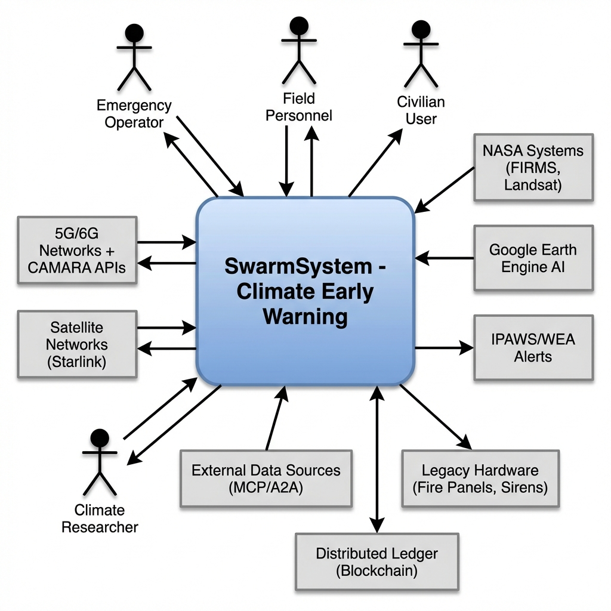
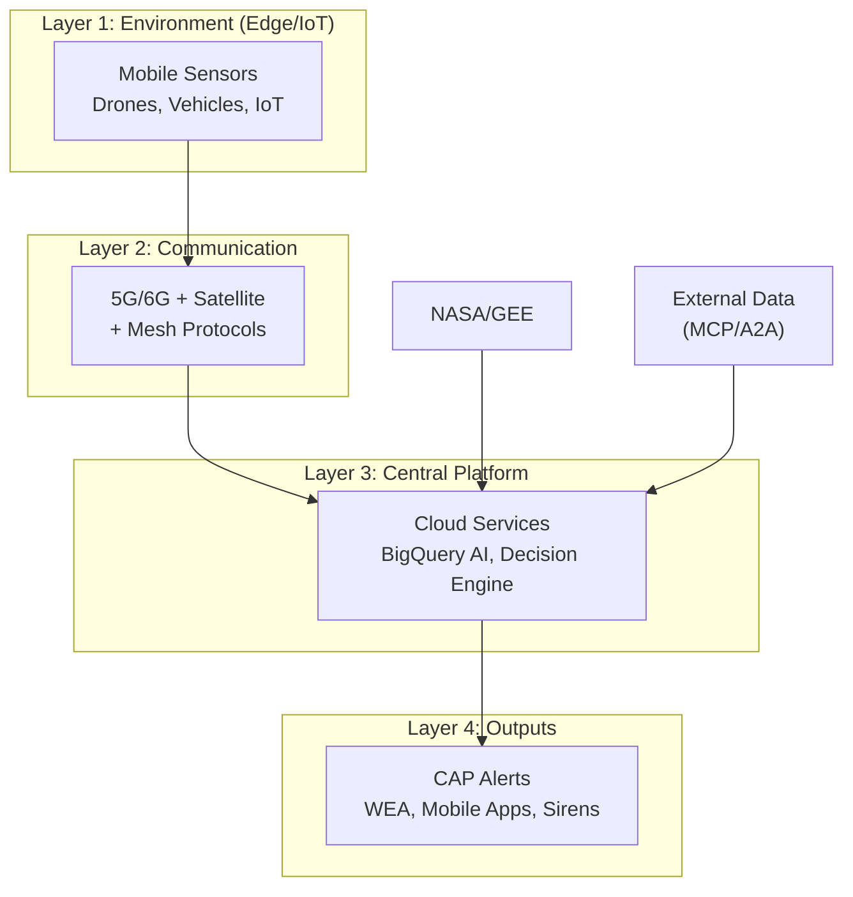
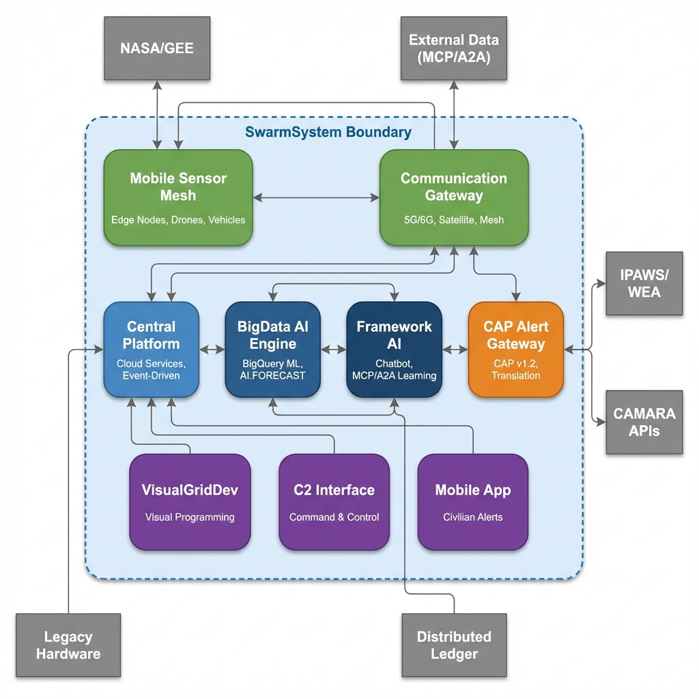
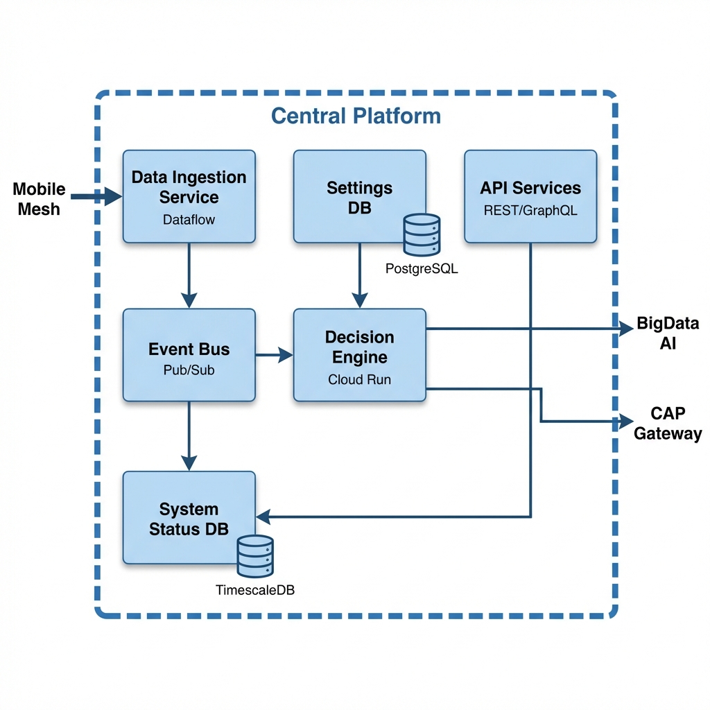
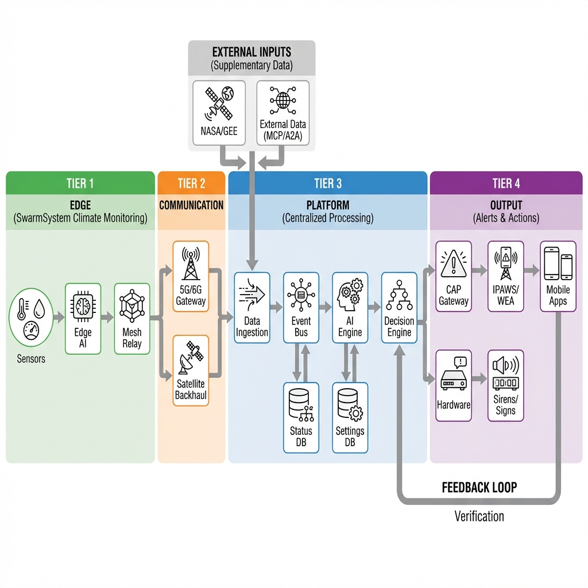
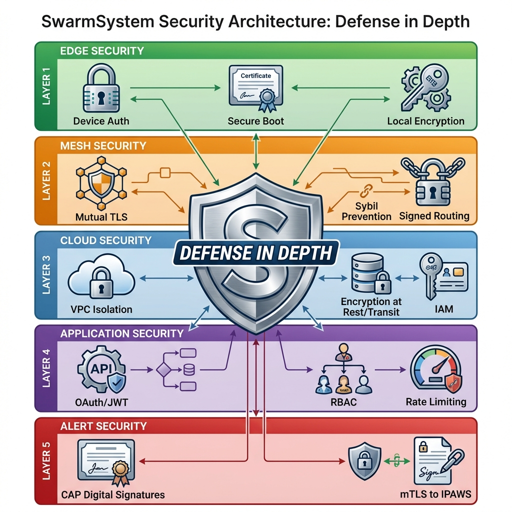
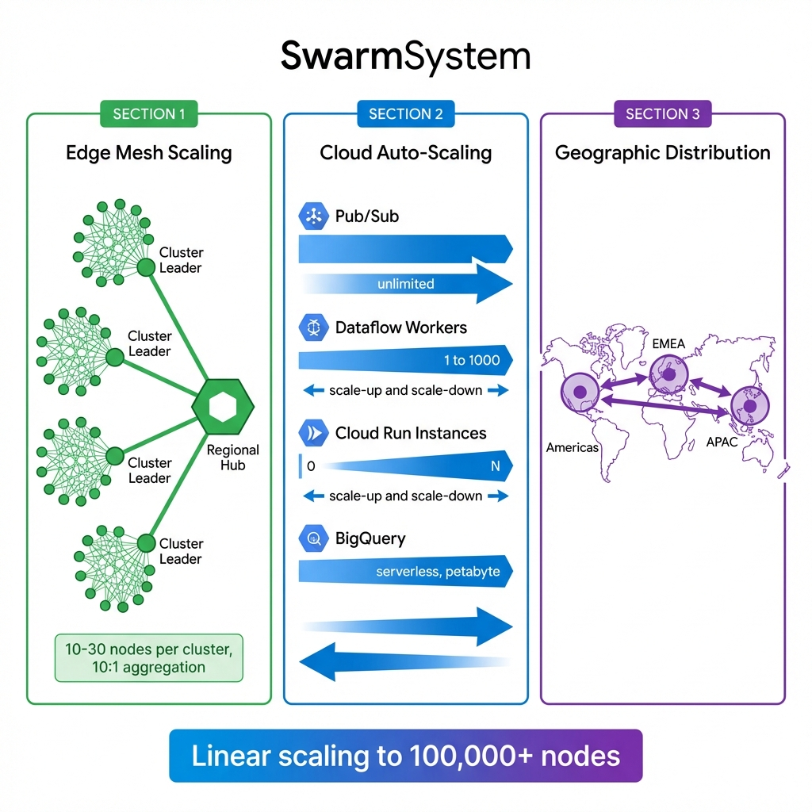
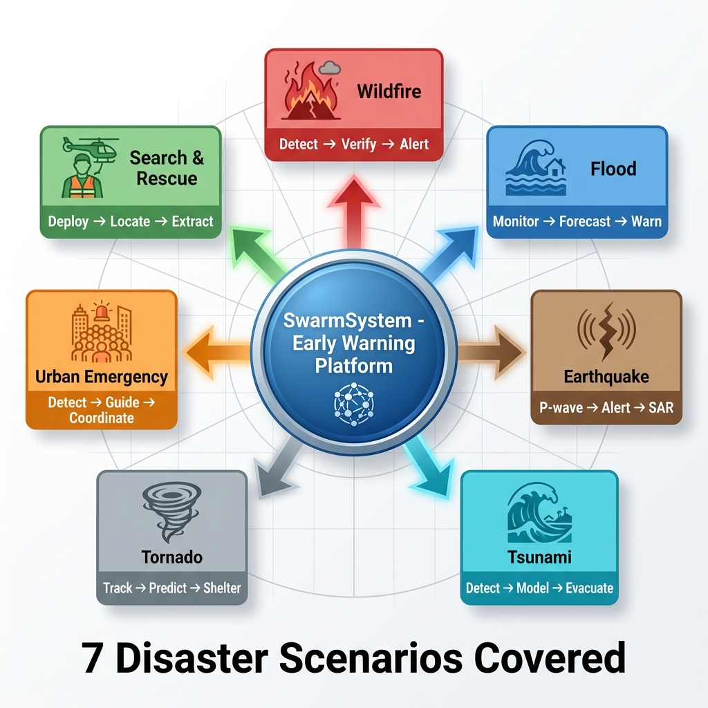
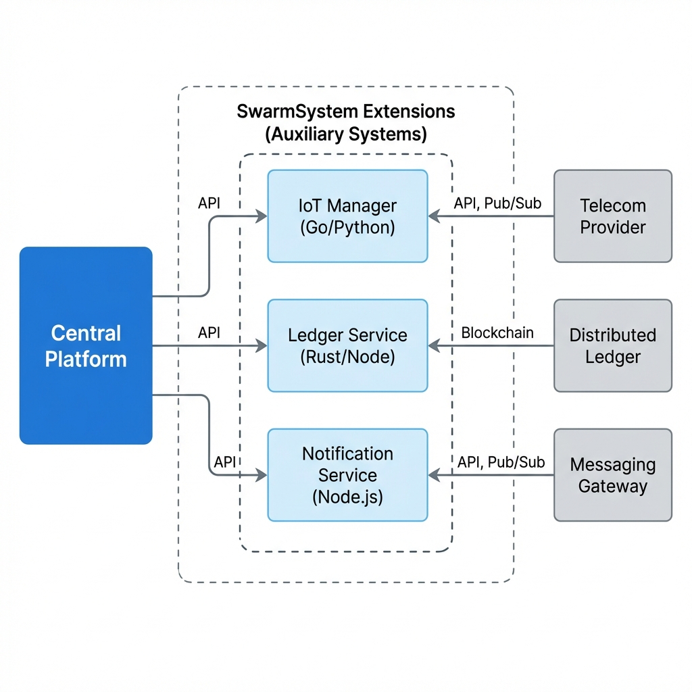

# SwarmSystem Architecture Documentation

## Overview

This is the architecture documentation index for the **Live Mobile Edge Sensors Swarm System (SwarmSystem)** - a decentralized, autonomous climate monitoring and early warning platform.

## Quick Reference

| Document | Purpose | Key Contents |
|----------|---------|--------------|
| [C4_Context.md](./C4_Context.md) | System boundary | External actors, integrated systems |
| [C4_Container.md](./C4_Container.md) | Major subsystems | 9 containers, technology stack |
| [C4_Component.md](./C4_Component.md) | Internal structure | Components per container |
| [DataFlow.md](./DataFlow.md) | Data movement | 6 flow paths, schemas |
| [Deployment.md](./Deployment.md) | Physical topology | 4 tiers, DR strategy |
| [Security.md](./Security.md) | Security layers | 5 layers, threat model |
| [Scalability.md](./Scalability.md) | Scaling patterns | Performance targets |
| [TechnicalProtocols.md](./TechnicalProtocols.md) | Protocol details | AODV, TORA, A2A, MCP, CAP |
| [UserFlows.md](./UserFlows.md) | Scenarios | 7 disaster types, state diagrams |
| [AuxiliarySystems.md](./AuxiliarySystems.md) | Support Services | IoT, Ledger, Notification diagrams |

## Architecture at a Glance

## System Diagrams

### C4 Diagrams
-  - System context and boundaries
-  - Major containers and interactions
-  - Component structure

### Flow Diagrams
-  - End-to-end data movement
-  - Physical topology

### Additional Diagrams
-  - Security layers
-  - Scaling architecture
-  - Scenario sequences
-  - Support services architecture

## Key Integrations

| Integration | Purpose | Protocol |
|-------------|---------|----------|
| **NASA/GEE** | Satellite data, foundation models | REST API |
| **IPAWS/WEA** | Public alert dissemination | CAP v1.2 |
| **CAMARA** | Mobile network APIs (urban) | CAMARA API |
| **Framework AI** | Chatbot, document learning | MCP/A2A |
| **Distributed Ledger** | Audit trail | Blockchain API |

## Disaster Scenarios Covered

1. **Wildfire** - Detection, prediction, perimeter tracking
2. **Flood** - Water level monitoring, breach alerts
3. **Earthquake** - P-wave warning, SAR coordination
4. **Tsunami** - Offshore detection, coastal evacuation
5. **Tornado** - Supercell tracking, path prediction
6. **Urban Mob** - Crowd density, emergency guidance
7. **Search & Rescue** - Survivor location, AR navigation

## PRD Traceability

All architecture documents include requirement traceability back to:
- `PRD_Swarm_System_Requirements_Specification.md`
- `PRD_Other_Integrations.md`

Key requirements addressed:
- **REQ-GEN-001 to 006**: Autonomy, decentralization, scalability
- **REQ-EDGE-001 to 009**: Sensor nodes, fusion, navigation
- **REQ-COM-001 to 011**: Mesh networking, routing, backhaul
- **REQ-PLAT-001 to 008**: Central platform, decisions
- **REQ-AI-001 to 006**: Hybrid AI, federated learning
- **REQ-EXT-001 to 007**: External integrations
- **REQ-HSI-001 to 005**: Human-swarm interaction
- **REQ-PERF-001 to 003**: Performance targets
- **REQ-REL-001 to 003**: Reliability, ruggedization
- **REQ-SEC-001 to 003**: Security controls

## Reference Images

- [SwarmSystem.png](../SwarmSystem.png) - Original system overview
- [BigData_AI_Decision_System/](../BigData_AI_Decision_System/) - AI engine implementation

---

*Architecture documentation generated for the Mobile-Mesh-EWS project.*
*Last updated: January 2026*
