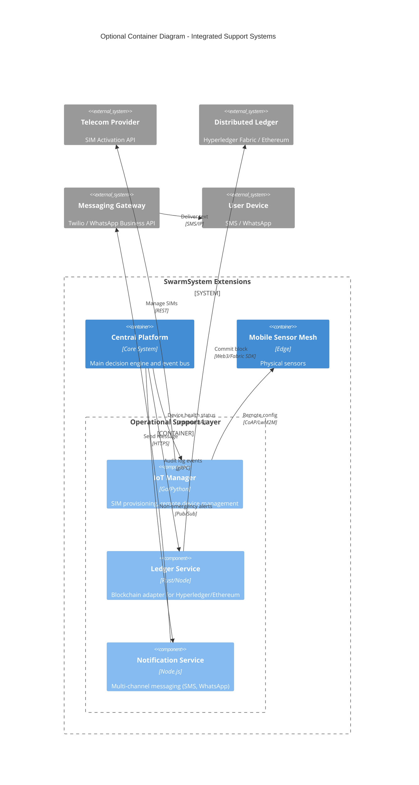

# Auxiliary Systems Diagram (Optional)

## Overview

This diagram visualizes the optional subsystem containers identified during verification (`IoT Manager`, `Ledger Service`, `Notification Service`) which handle specific operational duties distinct from the main data path.

## Integrated Subsystems Architecture

## Component Responsibilities

| Container | Responsibility | Integration Point |
|-----------|----------------|-------------------|
| **IoT Manager** | Managing SIM lifecycle (activate/deactivate), remote firmware updates, device health checks. | `IoT_Operations` directory |
| **Ledger Service** | Adapter for writing immutable audit logs to blockchain (Hyperledger/Ethereum). Abstracts chain complexity from core platform. | `Distributed_Ledgers_Operations` directory |
| **Notification Service** | Managing low-latency, high-volume notifications via consumer channels (WhatsApp, Telegram, SMS) distinct from official CAP alerts. | `Communications_APIs` directory |
