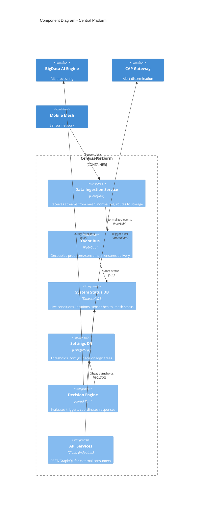
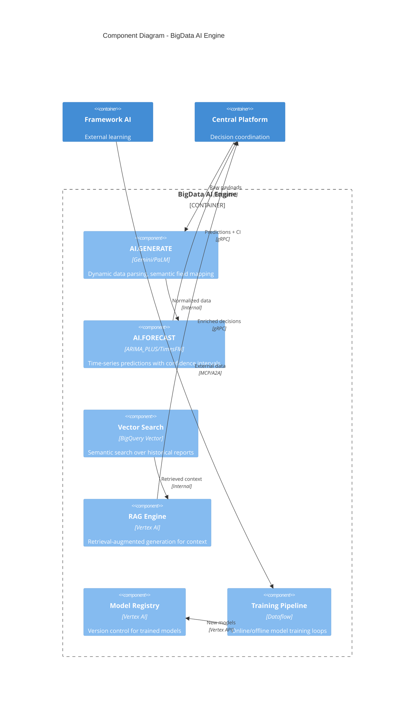
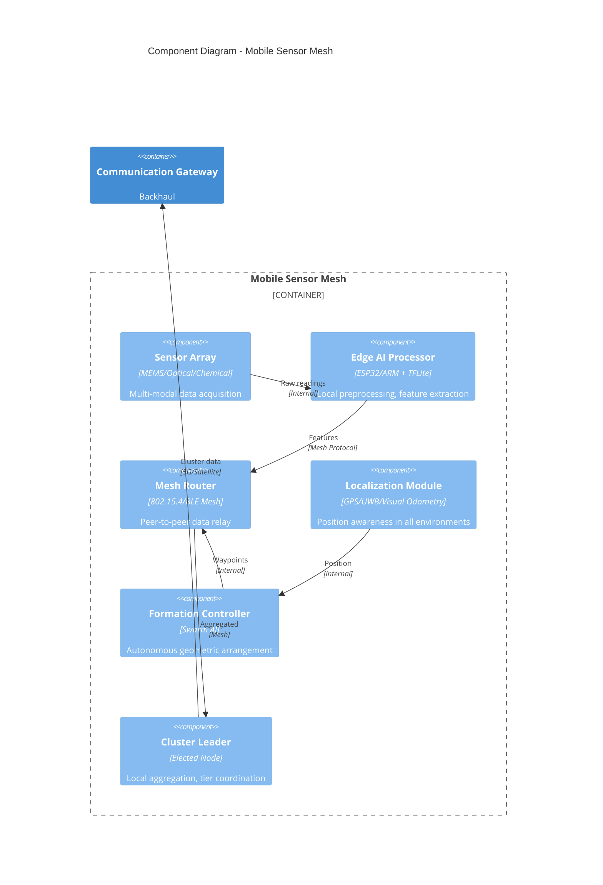
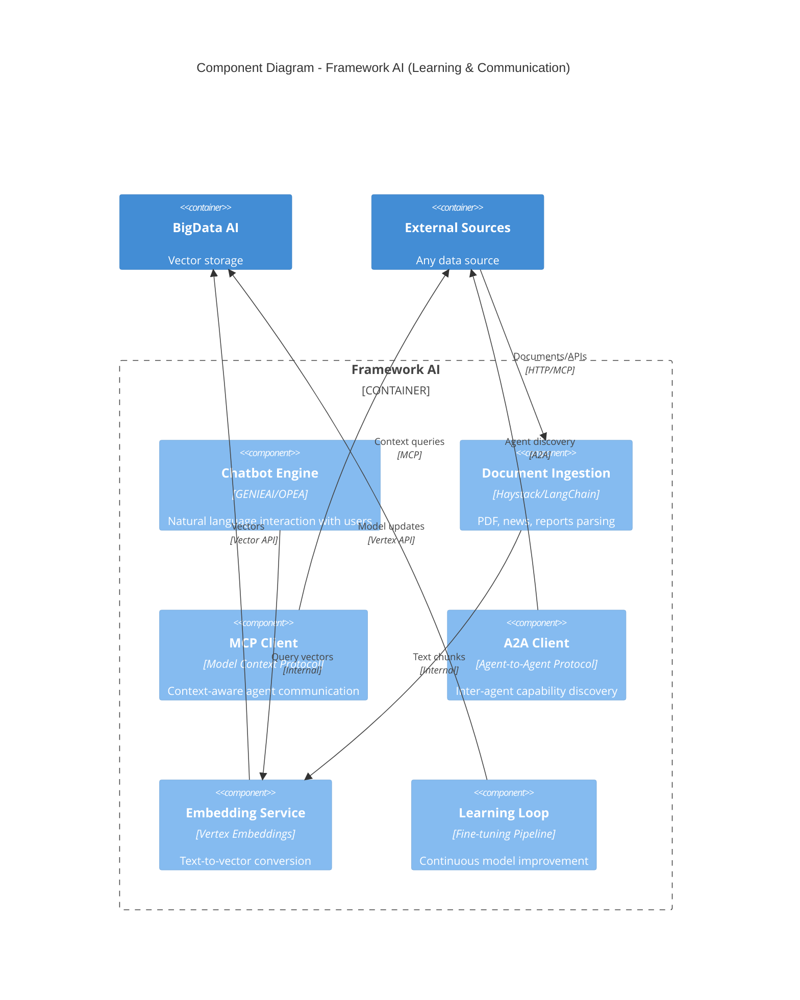
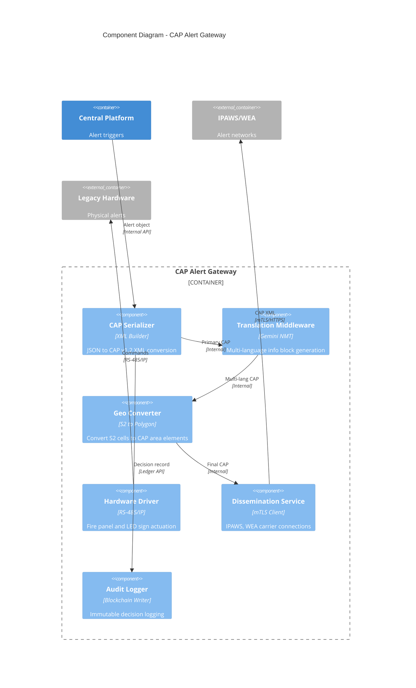
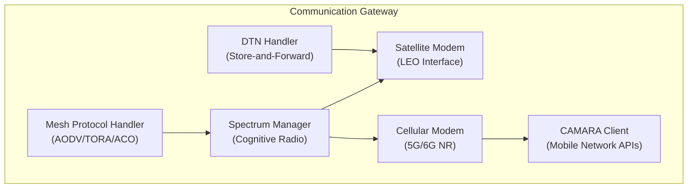

# C4 Component Diagram - SwarmSystem

## Component Architecture Overview

This document details the key components within each major container of the SwarmSystem, showing internal structure and responsibilities.

## Central Platform Components

### Central Platform Component Details

| Component | Technology | Responsibility | REQ Reference |
|-----------|------------|----------------|---------------|
| **Data Ingestion Service** | GCP Dataflow | Stream processing, schema validation, routing | REQ-PLAT-001 |
| **Event Bus** | GCP Pub/Sub | Async messaging, guaranteed delivery | REQ-PLAT-001 |
| **System Status DB** | TimescaleDB | Live conditions, locations, sensor health, coverage areas | REQ-PLAT-002 |
| **Settings DB** | PostgreSQL (3NF) | Thresholds, configs, historical stats, decision logic | REQ-PLAT-003 |
| **Decision Engine** | Cloud Run | Swarm decisions, incident response decisions | REQ-PLAT-004, REQ-PLAT-005 |
| **API Services** | Cloud Endpoints | External data access for researchers, 3rd parties | REQ-PLAT-008 |

---

## BigData AI Engine Components

### BigData AI Component Details

| Component | Technology | Responsibility | REQ Reference |
|-----------|------------|----------------|---------------|
| **AI.GENERATE** | Gemini/PaLM via BigQuery Remote Models | Schema-drift-resilient data parsing | PRD Other #3.1 |
| **AI.FORECAST** | ARIMA_PLUS, TimesFM | Rolling 6-hour forecasts, 15-min granularity | PRD Other #3.2, REQ-AI-003 |
| **Vector Search** | BigQuery Vector Index | Semantic search over climate reports | PRD Other #3.3 |
| **RAG Engine** | Vertex AI | Contextual enrichment from historical events | REQ-AI-006 |
| **Model Registry** | Vertex AI Model Registry | Model versioning, shadow mode evaluation | REQ-LOOP-002 |
| **Training Pipeline** | Dataflow + Federated Learning | Hybrid cloud/edge training | REQ-AI-001, REQ-AI-002 |

---

## Mobile Sensor Mesh Components

### Mesh Component Details

| Component | Responsibility | REQ Reference |
|-----------|----------------|---------------|
| **Sensor Array** | Multi-modal sensing (optical, thermal, chemical, seismic, hydro) | REQ-EDGE-004 |
| **Edge AI Processor** | Local inference, feature extraction (<1MB models) | REQ-EDGE-003 |
| **Mesh Router** | Self-healing relay, dynamic routing | REQ-COM-001, REQ-COM-002 |
| **Localization Module** | GPS + relative positioning in denied environments | REQ-EDGE-007 |
| **Formation Controller** | Autonomous arrangement (search lines, perimeters) | REQ-EDGE-009 |
| **Cluster Leader** | Democratic election, local aggregation | REQ-GEN-003 |

---

## Framework AI Components

### Framework AI Component Details

| Component | Technology | Responsibility | REQ Reference |
|-----------|------------|----------------|---------------|
| **Chatbot Engine** | GENIEAI/OPEA/Haystack | User communication, natural language queries | User Req #6 |
| **Document Ingestion** | LangChain/Haystack | Parse any document format for learning | User Req #8 |
| **MCP Client** | Model Context Protocol | Context-aware external data queries | PRD Other #5.2 |
| **A2A Client** | Agent-to-Agent Protocol | Capability discovery, inter-agent coordination | PRD Other #5.2 |
| **Embedding Service** | Vertex AI Embeddings | Convert text to searchable vectors | PRD Other #3.3 |
| **Learning Loop** | Continuous fine-tuning | Improve models from new external data | REQ-AI-004 |

---

## CAP Alert Gateway Components

### CAP Gateway Component Details

| Component | Responsibility | REQ Reference |
|-----------|----------------|---------------|
| **CAP Serializer** | Map internal severity to CAP enumerations (Urgency, Severity, Certainty) | PRD Other #4.1 |
| **Translation Middleware** | <200ms multi-language generation | PRD Other #4.2 |
| **Geo Converter** | S2 cell to polygon/circle for area targeting | PRD Other #4.1 |
| **Hardware Driver** | Notifier fire panels, LED signs, sirens | PRD Other #4.3 |
| **Dissemination Service** | Secure connections to IPAWS, carriers | PRD Other #4.4 |
| **Audit Logger** | Blockchain logging for accountability | REQ-PLAT-006 |

---

## Communication Gateway Components

### Communication Gateway Component Details

| Component | Responsibility | REQ Reference |
|-----------|----------------|---------------|
| **Mesh Protocol Handler** | AODV (stable), TORA (dynamic), ACO (optimization) | REQ-COM-004, REQ-COM-005, REQ-COM-006 |
| **Spectrum Manager** | Cognitive radio, TV white spaces, interference avoidance | REQ-COM-009 |
| **Satellite Modem** | LEO constellation interface (Starlink/Iridium) | REQ-COM-010 |
| **Cellular Modem** | 5G/6G with OTFS modulation for high-velocity | REQ-COM-007, REQ-COM-008 |
| **DTN Handler** | Store-and-forward for connectivity gaps | REQ-COM-011 |
| **CAMARA Client** | Mobile network APIs for urban context | User Req #5 |

---

*Diagram follows C4 Model Level 3 (Component) - shows internal structure of each container.*
