# C4 Container Diagram - SwarmSystem

## Container Architecture Overview

The SwarmSystem is composed of multiple containers (deployable units) that work together to provide distributed climate monitoring, AI-driven decision making, and multi-channel alerting capabilities.

## Container Diagram

```mermaid
C4Container
    title Container Diagram - SwarmSystem Architecture

    Person(operator, "Emergency Operator", "Command & Control")
    Person(civilian, "Civilian User", "Alert recipient")

    System_Boundary(swarm_boundary, "SwarmSystem") {
        Container(mobile_mesh, "Mobile Sensor Mesh", "Edge Nodes, Drones, Vehicles, IoT", "Distributed network of heterogeneous sensors with local AI processing")
        
        Container(comm_gateway, "Communication Gateway", "5G/6G, Satellite, Mesh Protocols", "Multi-modal connectivity layer with self-healing routing")
        
        Container(central_platform, "Central Platform", "Cloud Services, Event-Driven", "Data aggregation, streaming, and coordination hub")
        
        Container(bigdata_ai, "BigData AI Engine", "BigQuery ML, Vertex AI", "AI.GENERATE, AI.FORECAST, Vector Search, RAG for decision support")
        
        Container(framework_ai, "Framework AI", "GENIEAI/OPEA/Haystack", "Chatbot communications, document ingestion, MCP/A2A learning")
        
        Container(cap_gateway, "CAP Alert Gateway", "Node.js/Python", "CAP v1.2 compliance, multi-language translation, hardware integration")
        
        Container(visual_grid, "VisualGridDev", "Web-based VPE", "Visual programming for mesh orchestration and agentic flows")
        
        Container(c2_interface, "C2 Interface", "React/WebGL", "Swarm visualizations, intent-based commands, AR support")
        
        Container(mobile_app, "Mobile Client App", "iOS/Android", "Alert reception, crowdsourced verification, offline maps")
    }

    System_Ext(nasa, "NASA/GEE", "External data sources")
    System_Ext(ipaws, "IPAWS/WEA", "Public alert systems")
    System_Ext(camara, "CAMARA APIs", "Mobile network APIs")
    System_Ext(iot_layer, "IoT Operations", "Edge device management")
    System_Ext(blockchain, "Distributed Ledger", "Audit trail")

    Rel(operator, c2_interface, "Issues commands", "HTTPS")
    Rel(civilian, mobile_app, "Receives alerts", "Push/WEA")
    
    Rel(mobile_mesh, comm_gateway, "Transmits sensor data", "Mesh/5G")
    Rel(comm_gateway, central_platform, "Streams data", "Pub/Sub")
    Rel(central_platform, bigdata_ai, "Queries predictions", "SQL/gRPC")
    Rel(bigdata_ai, framework_ai, "Contextual embeddings", "Vector API")
    Rel(central_platform, cap_gateway, "Triggers alerts", "Internal API")
    Rel(cap_gateway, ipaws, "Publishes CAP", "XML/HTTPS")
    Rel(visual_grid, mobile_mesh, "Deploys logic", "A2A/MCP")
    Rel(c2_interface, central_platform, "Commands/queries", "WebSocket")
    Rel(mobile_app, central_platform, "Verification feedback", "REST")
    
    Rel(central_platform, nasa, "Ingests data", "REST")
    Rel(comm_gateway, camara, "Network context", "CAMARA API")
    Rel(framework_ai, blockchain, "Logs decisions", "Ledger API")
    Rel(central_platform, iot_layer, "Device management", "CoAP/MQTT")

    UpdateLayoutConfig($c4ShapeInRow="3", $c4BoundaryInRow="1")
```



## Container Descriptions

### Edge Tier

| Container | Technology | Responsibilities |
|-----------|------------|------------------|
| **Mobile Sensor Mesh** | ESP32, ARM Cortex, MEMS Sensors | Sensor data acquisition, edge preprocessing, local swarm decisions, mesh routing |

### Communication Tier

| Container | Technology | Responsibilities |
|-----------|------------|------------------|
| **Communication Gateway** | 5G/6G NR, LoRaWAN, Satellite Modems | Multi-modal connectivity, self-healing routing (AODV/TORA), DTN store-and-forward |

### Platform Tier

| Container | Technology | Responsibilities |
|-----------|------------|------------------|
| **Central Platform** | GCP Pub/Sub, Dataflow, Cloud Run | Data aggregation, event streaming, service orchestration |
| **BigData AI Engine** | BigQuery ML, Vertex AI, ARIMA_PLUS | AI.GENERATE (data normalization), AI.FORECAST (predictions), Vector Search + RAG |
| **Framework AI** | GENIEAI/OPEA/Haystack Integration | Chatbot for user communication, MCP/A2A document ingestion, external data learning |
| **CAP Alert Gateway** | Node.js, CAP v1.2, Gemini NMT | Alert generation, multi-language translation, fire panel/LED integration |
| **VisualGridDev** | Web VPE, JSON Flow Compiler | Visual programming for swarm logic, fleet management, canary deployments |

### User Interface Tier

| Container | Technology | Responsibilities |
|-----------|------------|------------------|
| **C2 Interface** | React, WebGL, WebSocket | Swarm visualizations (heatmaps, flow vectors), intent-based commands |
| **Mobile Client App** | React Native/Flutter | Alert display, offline caching, crowdsourced verification |

## Integration Points

### CAMARA Mobile Network APIs
- **Purpose**: Urban emergency scenarios with population density awareness
- **APIs Used**: Device Location, Geofencing, Network Status
- **Container**: Communication Gateway queries CAMARA for context

### Framework AI (Chatbot & Learning)
- **Purpose**: Natural language interaction with users, document ingestion, learning from any relevant data
- **Protocols**: MCP (Model Context Protocol), A2A (Agent-to-Agent)
- **Capabilities**: Ingest weather reports, news archives, research papers; learn patterns for prediction enhancement

### IoT Operations Layer  
- **Purpose**: Universal edge device management
- **Protocols**: CoAP, MQTT, LwM2M
- **Container**: Central Platform manages device lifecycle, firmware updates

### Communications APIs
- **Purpose**: Multi-channel notification delivery
- **Channels**: SMS, Email, Push Notifications, Voice
- **Container**: CAP Gateway and Central Platform utilize for admin/user/3rd-party communications

## Data Flow Summary

```
Mobile Sensors → Edge Preprocessing → Mesh Relay → Communication Gateway
       ↓                                                    ↓
Local Swarm Decision                              Central Platform (Pub/Sub)
       ↓                                                    ↓
Immediate Alert                           BigData AI ←→ Framework AI (Learning)
(via Mesh)                                              ↓
                                                  CAP Gateway → IPAWS/WEA
                                                        ↓
                                                  Legacy Hardware (Sirens)
```

## Requirements Traceability

| Requirement | PRD Reference | Container(s) |
|-------------|---------------|--------------|
| Edge preprocessing | REQ-EDGE-003 | Mobile Sensor Mesh |
| Self-healing mesh | REQ-COM-002 | Communication Gateway |
| Big data acquisition | REQ-PLAT-001 | Central Platform |
| AI.GENERATE ingestion | REQ-AI-001, REQ-AI-002 | BigData AI Engine |
| CAP compliance | REQ-EXT-005 | CAP Alert Gateway |
| Visual programming | REQ from VisualGridDev | VisualGridDev |
| Intent-based C2 | REQ-HSI-002 | C2 Interface |
| Offline mobile | UX Requirement | Mobile Client App |
| External data learning | User Req #8 | Framework AI |
| CAMARA integration | User Req #5 | Communication Gateway |

---

*Diagram follows C4 Model Level 2 (Container) - shows major deployable units within the system.*
