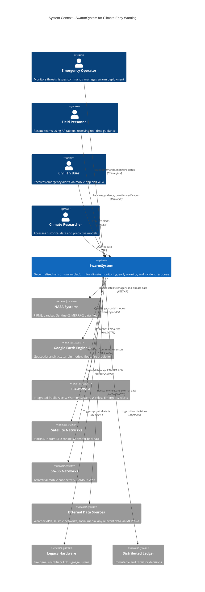

# C4 Context Diagram - SwarmSystem

## System Context Overview

The **Live Mobile Edge Sensors Swarm System (SwarmSystem)** is a decentralized, autonomous climate monitoring and early warning platform. It integrates mobile sensor networks, AI-driven decision making, and multi-channel alerting to provide real-time environmental awareness and disaster response capabilities.

## Context Diagram

## Actors and Systems Description

### Primary Actors

| Actor | Role | Interaction Mode |
|-------|------|------------------|
| **Emergency Operator** | Strategic command, swarm deployment, threshold configuration | C2 Web Console with swarm visualizations |
| **Field Personnel** | Tactical response, rescue operations, on-ground verification | AR headsets, mobile tablets connected to mesh |
| **Civilian User** | Alert recipient, crowdsourced verification | Native mobile app, WEA broadcasts |
| **Climate Researcher** | Data analysis, model improvement | REST/GraphQL APIs |

### External Systems

| System | Integration Purpose | Protocol |
|--------|---------------------|----------|
| **NASA Systems** | Foundation models, thermal anomaly detection (FIRMS), baseline environmental data | REST API |
| **Google Earth Engine AI** | Multi-source geospatial data, flood/fire spread simulation | Earth Engine API |
| **IPAWS/WEA** | Public alert dissemination, geo-targeted cellular broadcasts | CAP v1.2 XML |
| **Satellite Networks** | Communication backhaul for infrastructure-denied areas | LEO Constellation |
| **5G/6G Networks** | Primary data transport, CAMARA mobile network APIs for urban contexts | CAMARA/5G/6G |
| **External Data Sources** | Weather APIs, seismic networks, social media, documents - ingested via AI learning | MCP, A2A, REST APIs |
| **Legacy Hardware** | Fire control panels, public signage, sirens | RS-232/485, IP sockets |
| **Distributed Ledger** | Immutable audit trail for all automated decisions | Blockchain API |

## Key Design Decisions

1. **Decentralized Intelligence**: The SwarmSystem operates autonomously even when disconnected from cloud - local mesh decisions continue.

2. **Universal Data Ingestion**: AI framework (Framework_AI) ingests and learns from ANY relevant external data source via MCP/A2A protocols or standard APIs.

3. **Multi-Modal Alerting**: Alerts are disseminated through digital (apps, WEA) AND physical (sirens, LED signs) channels simultaneously.

4. **Standards Compliance**: CAP v1.2 ensures interoperability with national/international alert systems.

## Requirements Traceability

| Requirement | PRD Reference | How Addressed |
|-------------|---------------|---------------|
| Decentralized autonomous operation | REQ-GEN-001, REQ-GEN-003 | Swarm operates independently, leader election |
| External system integration | REQ-EXT-001 to REQ-EXT-007 | NASA, GEE, IPAWS, WEA integrations shown |
| CAP compliance | REQ-EXT-005 | CAP gateway to IPAWS |
| Blockchain logging | REQ-PLAT-006 | Distributed Ledger integration |
| Human-swarm interaction | REQ-HSI-001 to REQ-HSI-005 | C2 interface for operators, AR for field |

---

*Diagram follows C4 Model Level 1 (Context) - shows system boundary and external actors/systems.*
