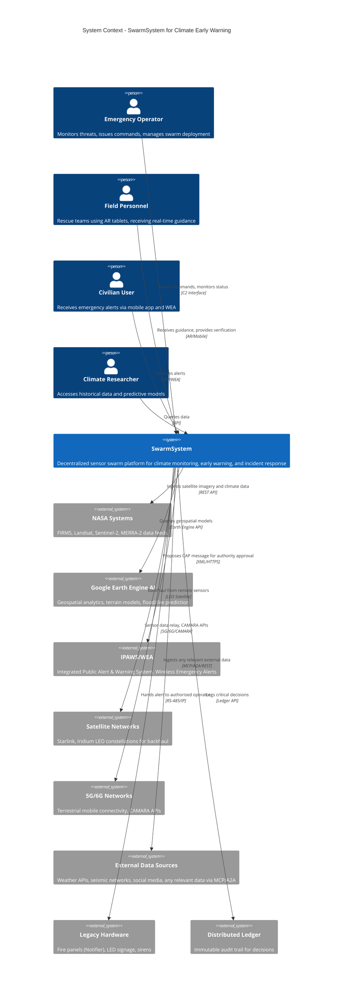

# C4 Context Diagram - SwarmSystem

> **Status: candidate design — not verified and not implemented.**
> This document is a proposal for review. It does not describe a deployed
> capability, it authorises no public alert or physical action, and it records
> no verified result. Numeric figures are acceptance targets, not measurements.
> See [PROJECT_STATUS.md](../PROJECT_STATUS.md) for the claim policy and the document
> precedence order.

## System Context Overview

The **Live Mobile Edge Sensors Swarm System (SwarmSystem)** is a _proposed_ decentralized climate-monitoring and early-warning design. It is intended to combine mobile sensor networks, analytical decision support, and multi-channel notification. No capability shown here is implemented or verified, and public warning and physical action remain with an authorised human authority.

## Context Diagram

```mermaid
C4Context
    title System Context - SwarmSystem for Climate Early Warning

    Person(operator, "Emergency Operator", "Monitors threats, issues commands, manages swarm deployment")
    Person(field_personnel, "Field Personnel", "Rescue teams using AR tablets, receiving real-time guidance")
    Person(civilian, "Civilian User", "Receives emergency alerts via mobile app and WEA")
    Person(researcher, "Climate Researcher", "Accesses historical data and predictive models")

    System(swarm_system, "SwarmSystem", "Decentralized sensor swarm platform for climate monitoring, early warning, and incident response")

    System_Ext(nasa, "NASA Systems", "FIRMS, Landsat, Sentinel-2, MERRA-2 data feeds")
    System_Ext(google_earth, "Google Earth Engine AI", "Geospatial analytics, terrain models, flood/fire prediction")
    System_Ext(ipaws, "IPAWS/WEA", "Integrated Public Alert & Warning System, Wireless Emergency Alerts")
    System_Ext(satellite_net, "Satellite Networks", "Starlink, Iridium LEO constellations for backhaul")
    System_Ext(telecom_5g6g, "5G/6G Networks", "Terrestrial mobile connectivity, CAMARA APIs")
    System_Ext(external_data, "External Data Sources", "Weather APIs, seismic networks, social media, any relevant data via MCP/A2A")
    System_Ext(legacy_hardware, "Legacy Hardware", "Fire panels (Notifier), LED signage, sirens")
    System_Ext(blockchain, "Distributed Ledger", "Immutable audit trail for decisions")

    Rel(operator, swarm_system, "Issues commands, monitors status", "C2 Interface")
    Rel(field_personnel, swarm_system, "Receives guidance, provides verification", "AR/Mobile")
    Rel(civilian, swarm_system, "Receives alerts", "CAP/WEA")
    Rel(researcher, swarm_system, "Queries data", "API")

    Rel(swarm_system, nasa, "Ingests satellite imagery and climate data", "REST API")
    Rel(swarm_system, google_earth, "Queries geospatial models", "Earth Engine API")
    Rel(swarm_system, ipaws, "Proposes CAP message for authority approval", "XML/HTTPS")
    Rel(swarm_system, satellite_net, "Backhaul from remote sensors", "LEO Satellite")
    Rel(swarm_system, telecom_5g6g, "Sensor data relay, CAMARA APIs", "5G/6G/CAMARA")
    Rel(swarm_system, external_data, "Ingests any relevant external data", "MCP/A2A/REST")
    Rel(swarm_system, legacy_hardware, "Hands alert to authorised operator", "RS-485/IP")
    Rel(swarm_system, blockchain, "Logs critical decisions", "Ledger API")

    UpdateLayoutConfig($c4ShapeInRow="3", $c4BoundaryInRow="1")
```

## Actors and Systems Description

### Primary Actors

| Actor | Role | Interaction Mode |
|-------|------|------------------|
| **Emergency Operator** | Strategic command, swarm deployment, threshold configuration | C2 Web Console with swarm visualizations |
| **Field Personnel** | Tactical response, rescue operations, on-ground verification | AR headsets, mobile tablets connected to mesh |
| **Civilian User** | Alert recipient, crowdsourced verification | Native mobile app, WEA broadcasts |
| **Climate Researcher** | Data analysis, model improvement | REST/GraphQL APIs |

### External Systems

| System | Integration Purpose | Protocol |
|--------|---------------------|----------|
| **NASA Systems** | Foundation models, thermal anomaly detection (FIRMS), baseline environmental data | REST API |
| **Google Earth Engine AI** | Multi-source geospatial data, flood/fire spread simulation | Earth Engine API |
| **IPAWS/WEA** | Public alert dissemination, geo-targeted cellular broadcasts | CAP v1.2 XML |
| **Satellite Networks** | Communication backhaul for infrastructure-denied areas | LEO Constellation |
| **5G/6G Networks** | Primary data transport, CAMARA mobile network APIs for urban contexts | CAMARA/5G/6G |
| **External Data Sources** | Weather APIs, seismic networks, social media, documents - ingested via AI learning | MCP, A2A, REST APIs |
| **Legacy Hardware** | Fire control panels, public signage, sirens | RS-232/485, IP sockets |
| **Distributed Ledger** | Optional tamper-evident audit trail for decisions (not a committed dependency) | Blockchain API |

## Key Design Decisions

1. **Decentralized Intelligence**: The SwarmSystem operates autonomously even when disconnected from cloud - local mesh decisions continue.

2. **Universal Data Ingestion**: AI framework (Framework_AI) ingests and learns from ANY relevant external data source via MCP/A2A protocols or standard APIs.

3. **No direct dissemination**: this design proposes no direct dissemination to apps, WEA, sirens, or signage. Notification is raised through the responsible authority's own systems and under its control.

4. **CAP as a target format**: CAP 1.2 is a proposed interchange format for the authority's workflow. No schema or profile conformance has been demonstrated, so "CAP-compatible" is not claimed. See [Compliance and Ethics](../Compliance_and_Ethics.md).

## Requirements Traceability

| Requirement | PRD Reference | How Addressed |
|-------------|---------------|---------------|
| Decentralized autonomous operation | REQ-GEN-001, REQ-GEN-003 | Swarm operates independently, leader election |
| External system integration | REQ-EXT-001 to REQ-EXT-007 | NASA, GEE, IPAWS, WEA integrations shown |
| CAP compliance | REQ-EXT-005 | CAP gateway to IPAWS |
| Blockchain logging | REQ-PLAT-006 | Distributed Ledger integration |
| Human-swarm interaction | REQ-HSI-001 to REQ-HSI-005 | C2 interface for operators, AR for field |

---

_Diagram follows C4 Model Level 1 (Context) - shows system boundary and external actors/systems._
