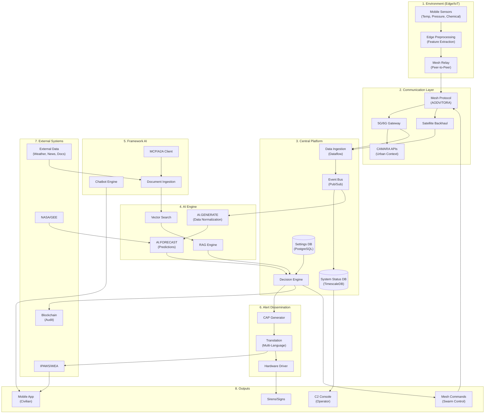
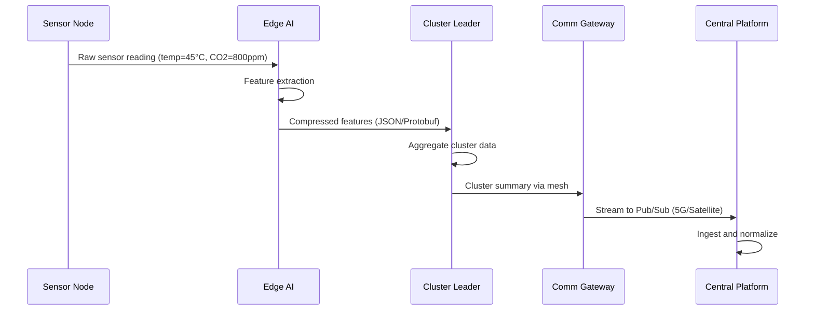
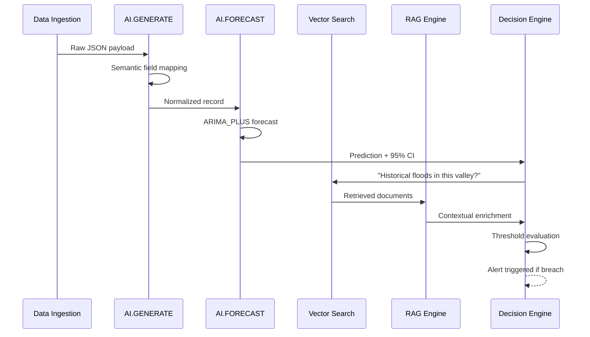
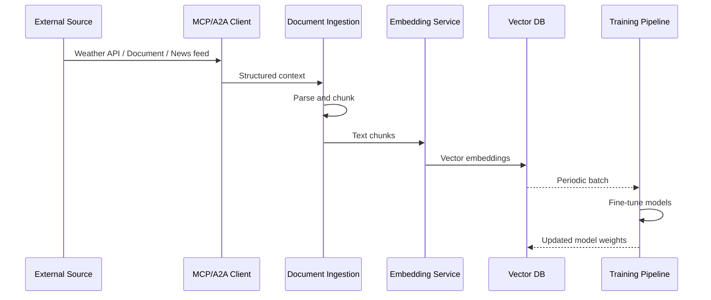
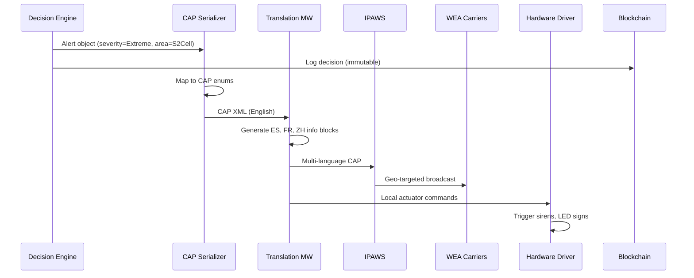
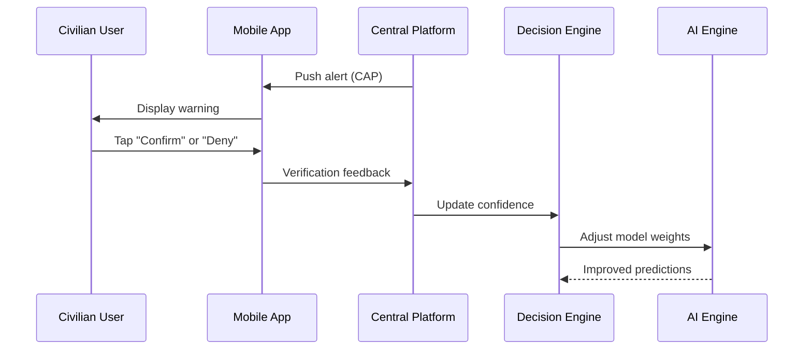
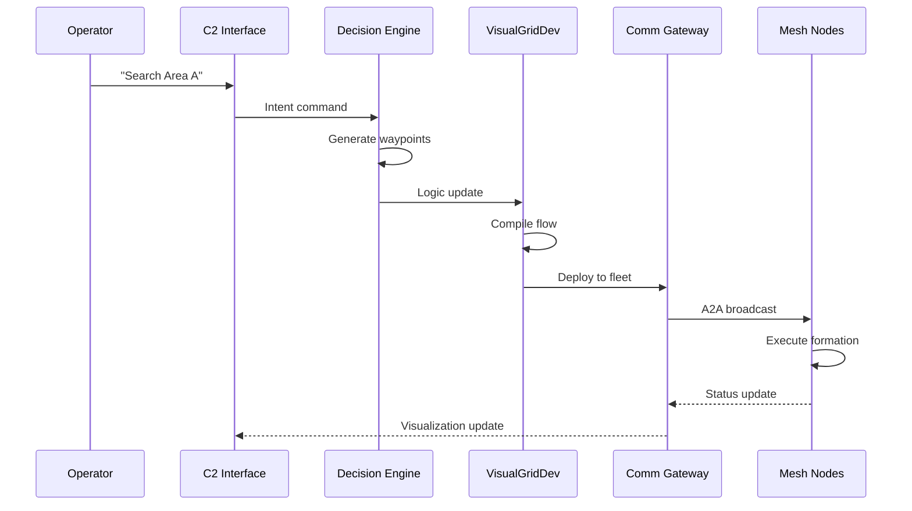

# Data Flow Architecture - SwarmSystem

## Data Flow Overview

This document describes the complete data flow through the SwarmSystem, from edge sensor acquisition through processing, decision-making, and alert dissemination.

## Primary Data Flow Diagram



## Flow Descriptions

### 1. Sensor Data Acquisition Flow



**Key Metrics:**
- Edge preprocessing reduces bandwidth by ~80%
- Cluster aggregation further reduces by ~50%
- Target: Edge-to-Cloud latency <5 seconds

### 2. AI Processing Flow



**AI Processing Stages:**

| Stage | Input | Output | Latency |
|-------|-------|--------|---------|
| AI.GENERATE | Raw JSON | Normalized schema | ~100ms |
| AI.FORECAST | Time-series | 6-hour prediction + CI | ~500ms |
| Vector Search | Query text | Top-K documents | ~50ms |
| RAG Enrichment | Docs + query | Contextual answer | ~200ms |

### 3. External Data Ingestion Flow



**Supported External Sources:**
- NASA FIRMS (thermal anomalies)
- Google Earth Engine (geospatial)
- Weather APIs (OpenWeatherMap, etc.)
- Seismic networks (USGS)
- Social media feeds
- Research documents (PDF, reports)
- News archives
- Any API via MCP/A2A adapters

### 4. Alert Generation Flow



**Alert Timing Requirements:**

| Stage | Target Latency |
|-------|----------------|
| Detection to Decision | <1 second |
| CAP Generation | <200ms |
| Translation | <200ms |
| IPAWS Delivery | <3 seconds |
| Hardware Actuation | Immediate |

### 5. Feedback Loop Flow



**Feedback Impact:**
- "Confirmed" by multiple users → Escalate to "Observed"
- "Denied" by multiple users → Flag for false positive review
- Feeds into continuous reinforcement learning (REQ-AI-004)

### 6. Swarm Command Flow



**Command Types:**
- High-level intent: "Cover Sector 4", "Monitor Perimeter B"
- Swarm auto-translates to individual waypoints
- Hot-swap logic without firmware updates

## Data Schema Summary

### Sensor Data Event
```json
{
  "event_id": "uuid",
  "timestamp": "ISO8601",
  "source_node": "node-id",
  "location_s2": "S2CellID",
  "readings": {
    "temperature_c": 45.2,
    "humidity_pct": 23,
    "co2_ppm": 800,
    "wind_speed_kmh": 25
  },
  "confidence": 0.95,
  "preprocessing_version": "v2.1"
}
```

### CAP Alert Object
```json
{
  "alert_id": "uuid",
  "urgency": "Immediate",
  "severity": "Extreme", 
  "certainty": "Observed",
  "event_type": "Fire",
  "area_polygon": [[lat, lon], ...],
  "headline": "Wildfire detected in Sector 7",
  "description": "...",
  "instruction": "Evacuate immediately",
  "languages": ["en", "es", "fr"]
}
```

## Requirements Traceability

| Data Flow | PRD Requirement | Implementation |
|-----------|-----------------|----------------|
| Edge preprocessing | REQ-EDGE-003 | Feature extraction before TX |
| Multi-modal fusion | REQ-EDGE-006 | Cluster-level correlation |
| Hybrid mesh routing | REQ-COM-004, REQ-COM-005 | AODV + TORA protocols |
| Big data ingestion | REQ-PLAT-001 | Pub/Sub + Dataflow |
| AI forecasting | REQ-AI-001, REQ-AI-003 | ARIMA_PLUS, LSTM |
| External learning | User Req #8 | MCP/A2A document ingestion |
| CAP compliance | REQ-EXT-005 | CAP v1.2 serialization |
| Blockchain audit | REQ-PLAT-006 | Decision logging |
| Feedback loop | REQ-AI-004 | Crowdsourced verification |

---

*This document describes the complete data flow architecture of the SwarmSystem.*
