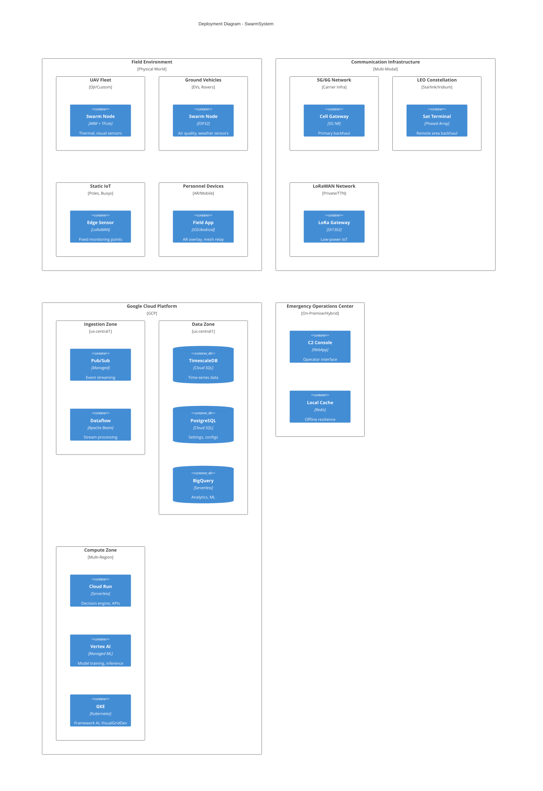
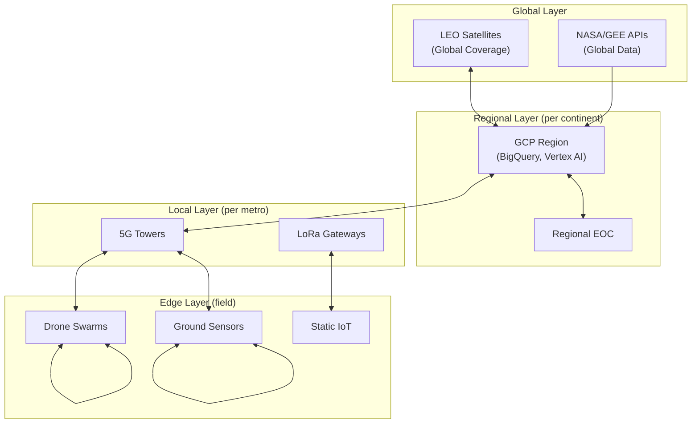

# Deployment Architecture - SwarmSystem

## Deployment Overview

The SwarmSystem follows a multi-tier deployment model spanning edge devices, communication infrastructure, and cloud services. This document describes the physical and logical deployment topology.

## Deployment Diagram

## Deployment Tiers

### Tier 1: Edge Devices

| Device Type | Hardware | Sensors | Connectivity | Deployment Scale |
|-------------|----------|---------|--------------|------------------|
| **UAV (Drone)** | ARM Cortex + GPU, TFLite | Thermal, Visual, Lidar | 5G/Satellite, Mesh | 100s per region |
| **Ground Vehicle** | ESP32, NVIDIA Jetson | Air quality, Weather, Road | 5G, WiFi, Mesh | 1000s per city |
| **Aquatic Buoy** | Solar, Low-power MCU | Water level, Temp, pH | LoRaWAN, Satellite | 10s per waterway |
| **Static Sensor** | ESP32, Energy harvesting | Temp, Humidity, Seismic | LoRaWAN | 1000s per region |
| **Wearable/Mobile** | Smartphone, AR headset | Location, Accelerometer | 5G, WiFi, BLE | Field personnel |

### Tier 2: Communication Infrastructure

| Component | Technology | Coverage | Redundancy |
|-----------|------------|----------|------------|
| **5G/6G Towers** | 5G NR, CAMARA APIs | Urban/suburban | Multi-carrier |
| **LEO Satellites** | Starlink, Iridium | Global | Constellation overlap |
| **LoRaWAN** | SX1302 gateways | Rural, fixed points | Gateway clustering |
| **Ad-hoc Mesh** | 802.15.4, BLE Mesh | Peer-to-peer | Self-healing |

### Tier 3: Cloud Platform (GCP)

| Service | Purpose | Region Strategy | SLA |
|---------|---------|-----------------|-----|
| **Pub/Sub** | Message ingestion | Multi-region | 99.95% |
| **Dataflow** | Stream processing | Regional | 99.9% |
| **BigQuery** | Analytics, ML | US/EU multi-region | 99.99% |
| **Cloud SQL** | Operational DBs | Regional + replicas | 99.95% |
| **Cloud Run** | Serverless compute | Multi-region | 99.95% |
| **Vertex AI** | Model serving | Regional | 99.9% |
| **GKE** | Container orchestration | Regional | 99.95% |

### Tier 4: Operations Center

| Component | Location | Purpose |
|-----------|----------|---------|
| **C2 Console** | EOC on-premise | Primary operator interface |
| **Local Cache** | EOC on-premise | Offline resilience if cloud unavailable |
| **VPN Gateway** | EOC on-premise | Secure cloud connectivity |

## Geographic Distribution

## Disaster Recovery Strategy

### Failure Scenarios

| Scenario | Impact | Mitigation |
|----------|--------|------------|
| **Cloud region outage** | Platform unavailable | Multi-region failover, edge continues locally |
| **5G network down** | Urban backhaul lost | Automatic satellite failover |
| **Satellite outage** | Remote backhaul lost | DTN store-and-forward, mesh ferrying |
| **EOC destroyed** | Command center lost | Secondary EOC activation, cloud-direct ops |
| **Power grid failure** | Infrastructure down | Solar/battery on edge, generator at EOC |

### Recovery Objectives

| Metric | Target | Mechanism |
|--------|--------|-----------|
| **RTO (Recovery Time)** | <15 minutes | Automated failover |
| **RPO (Data Loss)** | <1 minute | Continuous replication |
| **Edge Autonomy** | Indefinite | Local mesh operation without cloud |

## Environment Configuration

### Development
- GCP Project: `swarm-dev`
- Single region, scaled-down resources
- Synthetic sensor data from simulators

### Staging
- GCP Project: `swarm-staging`
- Multi-region, production-like
- Limited real sensors + synthetic traffic

### Production
- GCP Project: `swarm-prod`
- Full multi-region deployment
- All real sensors, full redundancy
- 24/7 monitoring with PagerDuty

## Requirements Traceability

| Requirement | PRD Reference | Deployment Implementation |
|-------------|---------------|---------------------------|
| Heterogeneous sensors | REQ-GEN-005 | Multiple device types in Tier 1 |
| Satellite backhaul | REQ-COM-010 | LEO constellation in Tier 2 |
| Multi-region resilience | REQ-REL-003 | GCP multi-region deployment |
| No single point of failure | REQ-REL-003 | Mesh + satellite + DTN redundancy |
| Edge autonomy | REQ-GEN-001 | Local operation without cloud |

---

*This document describes the physical deployment architecture of the SwarmSystem.*
