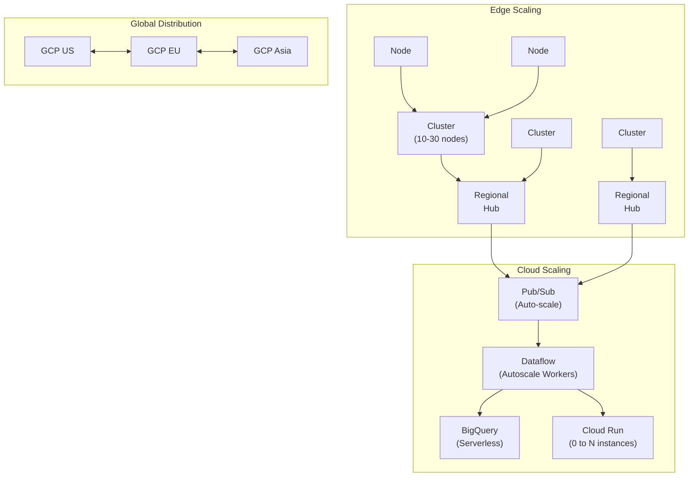
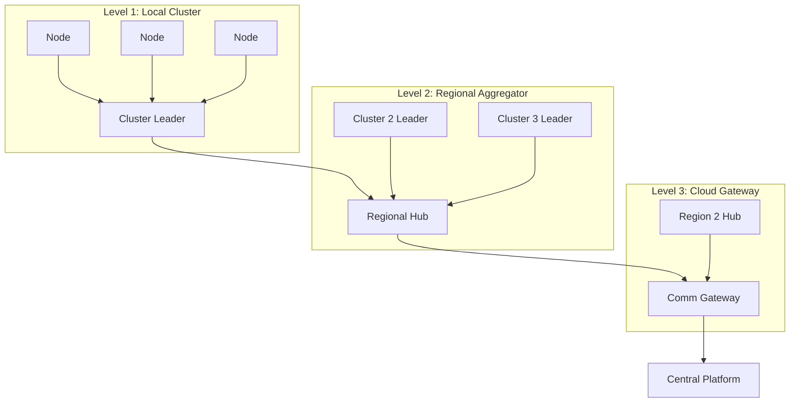
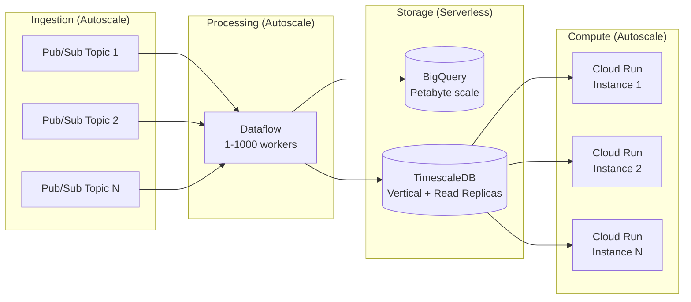
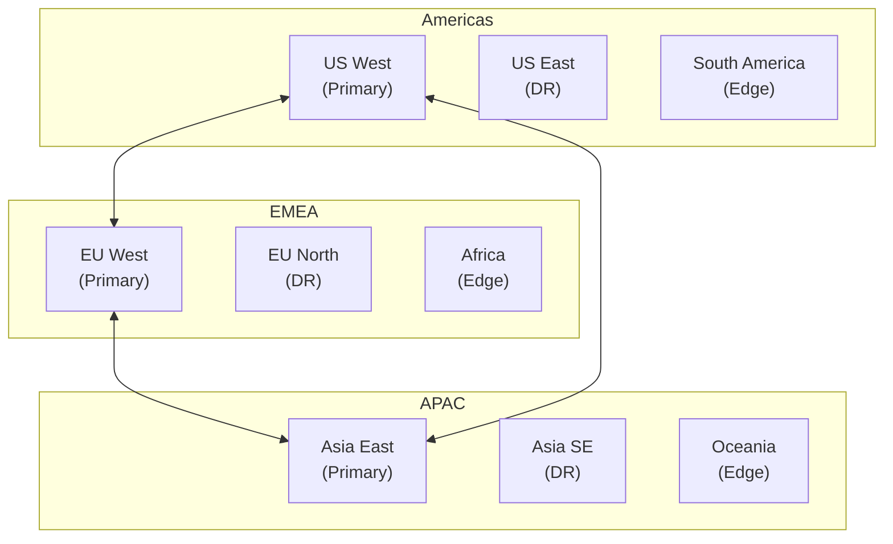

# Scalability Architecture - SwarmSystem

## Scalability Overview

The SwarmSystem is designed to scale from local deployments of dozens of sensors to global networks of thousands of nodes. This document describes the horizontal and vertical scaling patterns, performance targets, and capacity planning.

## Scalability Diagram



## Scaling Dimensions

### 1. Edge Mesh Scaling

The mesh network scales through hierarchical clustering:



| Level | Nodes | Aggregation Ratio | Leader Election |
|-------|-------|-------------------|-----------------|
| **Local Cluster** | 10-30 | 10:1 | Democratic (REQ-GEN-003) |
| **Regional Hub** | 100-300 | 10:1 | Pre-designated + failover |
| **Cloud Gateway** | 1000+ | Variable | Infrastructure-based |

**Key Scaling Properties:**
- Linear performance up to thousands of nodes (REQ-GEN-004)
- No central coordinator required at edge level
- Dynamic entry/exit without reconfiguration (REQ-GEN-006)

### 2. Communication Scaling

| Bottleneck | Mitigation | Scaling Limit |
|------------|------------|---------------|
| **Mesh hop count** | Hybrid circular/star topology (41-81% latency reduction) | <10 hops max |
| **Cluster bandwidth** | Edge preprocessing (80% reduction) | ~1 Mbps per cluster |
| **5G backhaul** | Multi-carrier, load balancing | ~100 Gbps per region |
| **Satellite slots** | Priority queueing, DTN | ~10 Mbps per region |

### 3. Cloud Platform Scaling



| Service | Scaling Type | Min | Max | Trigger |
|---------|--------------|-----|-----|---------|
| **Pub/Sub** | Automatic | N/A | Unlimited throughput | None needed |
| **Dataflow** | Horizontal | 1 worker | 1000 workers | CPU/backlog |
| **BigQuery** | Serverless | N/A | Petabyte scale | Automatic |
| **TimescaleDB** | Vertical + Read Replicas | 4 vCPU | 96 vCPU + 5 replicas | CPU >70% |
| **Cloud Run** | Horizontal | 0 instances | 1000 instances | Requests/CPU |
| **Vertex AI** | Horizontal | 1 replica | 100 replicas | Prediction latency |

## Performance Targets

### Latency Requirements (from PRD)

| Path | Requirement | Target | Approach |
|------|-------------|--------|----------|
| **Sensor → Cloud** | REQ-PERF-001 | <5 seconds | Edge preprocessing, direct backhaul |
| **Mesh-to-Mesh** | PRD Other | <200 ms | Peer-to-peer relay |
| **Decision → Alert** | REQ-PERF-001 | <1 second | In-memory decision engine |
| **Translation** | PRD Other | <200 ms | Pre-loaded NMT models |

### Reliability Requirements

| Metric | Requirement | Target | Approach |
|--------|-------------|--------|----------|
| **Packet Delivery** | REQ-PERF-002 | >95% at 20% node failure | Self-healing mesh, redundant paths |
| **Detection Accuracy** | REQ-PERF-003 | >99% | Multi-modal fusion, ML validation |
| **Gateway Availability** | PRD Other | 99.999% (Five Nines) | Multi-region, active-active |

### Throughput Capacity

| Metric | Current Design | Growth Path |
|--------|----------------|-------------|
| **Sensor events/sec** | 100,000 | +10x with Pub/Sub partitioning |
| **Concurrent alerts** | 1,000 | +10x with CAP gateway scaling |
| **AI predictions/min** | 10,000 | +100x with Vertex AI endpoints |
| **Active mesh nodes** | 10,000 | +10x with regional hub expansion |

## Geographic Scaling

### Multi-Region Strategy



| Region Type | Services | Data Replication |
|-------------|----------|------------------|
| **Primary** | Full stack (Platform + AI + Alerts) | Synchronous within region |
| **DR** | Hot standby, read replicas | Async replication (<1 min) |
| **Edge** | Comm Gateway only | Store-and-forward to primary |

## Load Balancing

### Mesh Level
- **Algorithm**: Swarm Intelligence (Ant Colony Optimization)
- **Optimization**: Battery life, link quality, hop count
- **PRD Reference**: REQ-COM-006

### Cloud Level
- **Global**: GCP Global Load Balancer (anycast)
- **Regional**: Cloud Run request distribution
- **Database**: Read replicas with connection pooling

## Capacity Planning

### Growth Scenarios

| Scenario | Nodes | Events/sec | Cloud Resources |
|----------|-------|------------|-----------------|
| **Pilot** | 100 | 1,000 | Minimal (dev tier) |
| **City** | 1,000 | 10,000 | Standard (2 regions) |
| **Nation** | 10,000 | 100,000 | Full (3 regions + DR) |
| **Global** | 100,000 | 1,000,000 | Multi-cloud consideration |

### Cost Scaling

| Component | Cost Driver | Optimization |
|-----------|-------------|--------------|
| **Edge devices** | Hardware unit cost | Bulk procurement, commodity parts |
| **Connectivity** | Data transfer | Edge preprocessing, compression |
| **Cloud compute** | Instance hours | Autoscaling, spot instances |
| **Cloud storage** | Data volume | TTL policies, tiered storage |
| **AI inference** | Predictions | Model quantization, batching |

## Scaling Patterns

### Pattern 1: Event-Driven Autoscaling
```
Pub/Sub message backlog → Scale Dataflow workers → Drain backlog → Scale down
```

### Pattern 2: Predictive Scaling
```
Historical patterns → Forecast event spikes → Pre-scale before disaster season
```

### Pattern 3: Geographic Expansion
```
New region deployed → Mesh nodes connect → Local aggregation → Federated to global
```

## Requirements Traceability

| Requirement | PRD Reference | Scalability Implementation |
|-------------|---------------|---------------------------|
| Linear scaling to 1000s | REQ-GEN-004 | Hierarchical clustering |
| Dynamic node entry/exit | REQ-GEN-006 | Auto-discovery, hot join |
| Low latency | REQ-PERF-001 | Edge processing, multi-region |
| High reliability | REQ-PERF-002 | Self-healing mesh, redundancy |
| Topology efficiency | REQ-COM-001 | Hybrid circular/star mesh |

---

*This document describes the scalability architecture of the SwarmSystem.*
