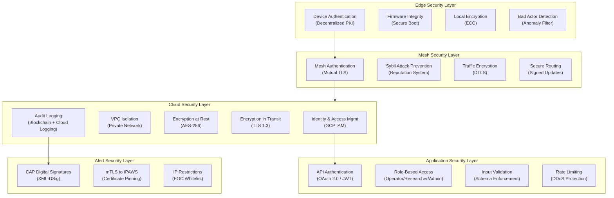
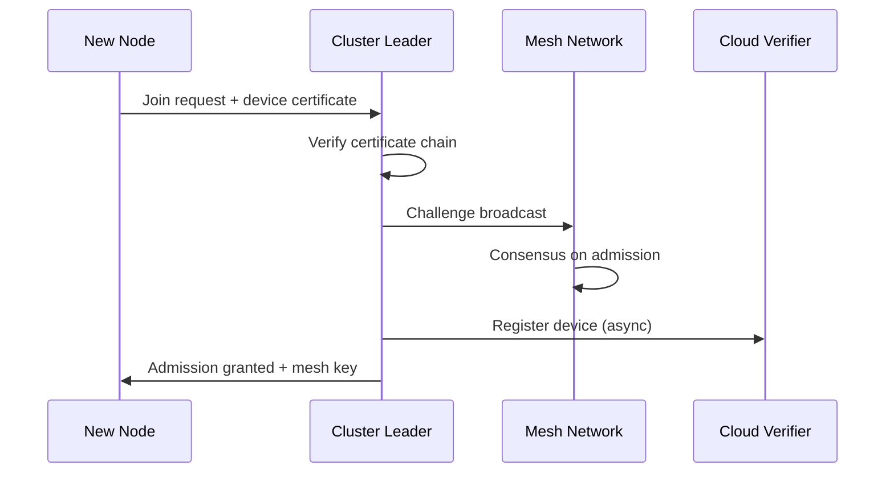
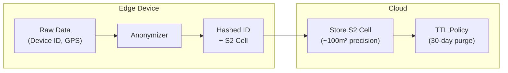
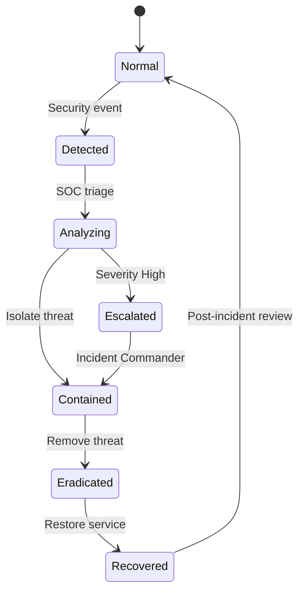

# Security Architecture - SwarmSystem

## Security Overview

The SwarmSystem implements defense-in-depth security across all layers, from edge device authentication to cloud data protection. This document describes the security architecture, threat model, and mitigation strategies.

## Security Architecture Diagram

## Security Layers Detail

### 1. Edge Device Security

| Control | Implementation | Threat Mitigated |
|---------|----------------|------------------|
| **Device Authentication** | Decentralized PKI with hardware-backed keys | Unauthorized device joining |
| **Secure Boot** | Signed firmware, integrity verification | Firmware tampering |
| **Local Encryption** | ECC (Elliptic Curve Cryptography) | Data exposure on lost device |
| **Anomaly Detection** | ML-based sensor value validation | Injected false data |
| **Provenance Metadata** | Device ID, Timestamp, Location, Signature | Data Spoofing/Replay |

**PRD Reference:** REQ-SEC-001, REQ-SEC-003

### 2. Mesh Network Security

| Control | Implementation | Threat Mitigated |
|---------|----------------|------------------|
| **Mutual TLS** | Certificate-based authentication between nodes | Man-in-the-middle |
| **Sybil Prevention** | Reputation scoring, resource challenges | Fake node flooding |
| **DTLS** | Datagram TLS for UDP mesh traffic | Eavesdropping |
| **Signed Routing** | Cryptographic signatures on routing updates | Route poisoning |

**PRD Reference:** REQ-SEC-001, REQ-SEC-002

### 3. Cloud Platform Security

| Control | Implementation | Threat Mitigated |
|---------|----------------|------------------|
| **GCP IAM** | Fine-grained permissions, service accounts | Privilege escalation |
| **VPC** | Private network, no public IPs for services | Network intrusion |
| **Encryption at Rest** | AES-256, customer-managed keys (CMEK) | Data theft |
| **Encryption in Transit** | TLS 1.3 everywhere | Interception |
| **Audit Logging** | Cloud Logging + Blockchain for decisions | Repudiation |

**PRD Reference:** REQ-PLAT-006

### 4. Application Security

| Control | Implementation | Threat Mitigated |
|---------|----------------|------------------|
| **OAuth 2.0 / JWT** | Token-based API authentication | Unauthorized access |
| **RBAC** | Roles: Operator, Researcher, Admin | Permission bypass |
| **Schema Validation** | Strict JSON/Protobuf schema enforcement | Injection attacks |
| **Rate Limiting** | Per-IP and per-token limits | DDoS, abuse |

### 5. Alert Dissemination Security

| Control | Implementation | Threat Mitigated |
|---------|----------------|------------------|
| **XML-DSig** | Digital signatures on every CAP message | Alert spoofing |
| **mTLS to IPAWS** | Mutual TLS with certificate pinning | Impersonation |
| **IP Whitelist** | Only EOC IPs can trigger manual alerts | Unauthorized alerting |
| **MFA for Admin** | Multi-factor for dashboard access | Credential theft |

**PRD Reference:** PRD Other #4.4, REQ-SEC-002

## Privacy Controls

### Data Anonymization

### Data Governance & Provenance

**Provenance Metadata Requirements:**
All data packets must include:
- **Device ID**: Cryptographically verifiable identity.
- **Timestamp**: High-precision timestamp synced via GPS/NTP.
- **Location**: Geolocation coordinates (or S2 cell).
- **Signature**: Digital signature using device's private key.

**Audit Trails:**
- Critical events (Alert Triggers, System Mode Changes) are logged to a permissioned blockchain ledger.
- Privacy-preserving access controls ensure only authorized reviewers can decrypt sensitive audit logs.

**Privacy Controls:**

| Control | Implementation | Compliance |
|---------|----------------|------------|
| **Edge Anonymization** | Device ID hashed and rotated | Privacy by Design |
| **Location Fuzzing** | GPS → S2 Cell (~100m²) | Minimize PII collection |
| **TTL Purge** | Raw logs deleted after 30 days | GDPR Right to Erasure |
| **Precision Rescue Mode** | User opt-in for exact location during emergency | Consent-based exception |

**PRD Reference:** PRD Other #7.1

## Threat Model

### Threat Actors

| Actor | Motivation | Capability |
|-------|------------|------------|
| **Script Kiddie** | Disruption, fame | Low - public tools |
| **Hacktivist** | Political message | Medium - targeted attacks |
| **Nation State** | Intelligence, disruption | High - APT, zero-days |
| **Insider Threat** | Financial, revenge | Medium - privileged access |
| **Bad Actor Node** | Sabotage, disinformation | Medium - physical access |

### Attack Surface and Mitigations

| Attack Vector | Risk | Mitigation |
|---------------|------|------------|
| **Rogue sensor injection** | False data → false alerts | Decentralized auth, anomaly detection |
| **Mesh protocol exploit** | Network disruption | Signed routing, reputation system |
| **Cloud API abuse** | Data exfiltration | OAuth, RBAC, rate limiting |
| **CAP message spoofing** | Fake public alerts | XML-DSig, mTLS, IP whitelist |
| **Firmware compromise** | Persistent backdoor | Secure boot, code signing |
| **DDoS on cloud** | Service unavailable | GCP DDoS protection, CDN |

## Security Operations

### Incident Response

### Monitoring and Alerting

| System | Purpose | Alert Threshold |
|--------|---------|-----------------|
| **Cloud Armor** | DDoS detection | >10k req/min |
| **Security Command Center** | Vulnerability scanning | Any critical finding |
| **Anomaly Detection (Edge)** | Bad actor nodes | Deviation >3σ |
| **Audit Log Monitor** | Privileged actions | Any manual alert trigger |

## Requirements Traceability

| Requirement | PRD Reference | Security Implementation |
|-------------|---------------|-------------------------|
| Decentralized auth | REQ-SEC-001 | Hardware-backed PKI per device |
| Encryption (edge) | REQ-SEC-002 | ECC for lightweight crypto |
| Bad actor detection | REQ-SEC-003 | ML anomaly detection + quarantine |
| Audit trail | REQ-PLAT-006 | Blockchain + Cloud Logging |
| Privacy by design | PRD Other #7.1 | Edge anonymization, TTL purge |

---

*This document describes the security architecture of the SwarmSystem.*
