# System Architecture Overview

This document provides a comprehensive architecture overview of the **Live Mobile Edge Sensors Swarm System**, aligned with the visual architecture.

The system is designed as a feedback loop between the physical environment (The Swarm) and the cloud-based Central Platform (The Brain), enabled by real-time communication.

## High-Level System Architecture (Visual Mirror)

The following diagram represents the logical flow and components as depicted in the official Swarm System architecture.

```mermaid
graph LR
    %% ---------------------------------------------------------
    %% 1. Data Collection and Monitoring (The Environment)
    %% ---------------------------------------------------------
    subgraph Environment ["1. Data Collection & Monitoring (Environment)"]
        direction TB
        NonRouted["Non-Routed / Static Sensors<br>(Flora/Fauna, IoT - Data Acquisition Only)"]
        Routed["System 'Routed' Connected Sensors<br>(Swarm Intelligent Clients - Mobile/Drones)"]
        
        %% Visual elements from SVG (Fish, Bee, Drone, Car) imply:
        %% - Ultra-low power static nodes (Flora/Fauna)
        %% - High-power routing nodes (Vehicles, Drones)
    end

    %% ---------------------------------------------------------
    %% 2. Communication
    %% ---------------------------------------------------------
    subgraph Communication ["2. Communication Layer"]
        Comm5G["5G / 6G Connectivity"]
        IoTEdge["IoT Edge Processing<br>(Initial Data Processing)"]
    end

    %% ---------------------------------------------------------
    %% 3. Central Platform
    %% ---------------------------------------------------------
    subgraph Platform ["3. Central Platform (Cloud Distributed Services)"]
        direction TB
        
        %% Data Storage
        subgraph Databases ["System State & Settings"]
            StatusDB[("System Status DB<br>(Live Conditions, Locations, Topology)")]
            SettingsDB[("System Settings DB<br>(Remote Config, Statistics, Decisions)")]
        end

        %% Analytics & AI
        subgraph Analytics ["Integration & Data Processing"]
            BigData["Synced Big Data Analytics<br>(Aggregation)"]
            
            %% AI Loop
            AITraining["Online/Offline AI Model Training<br>(LSTM, Deep Learning)"]
            AIEval{"AI Training Evaluation<br>(Local/Online Shadow Mode)"}
            TrainedModel["Trained Model Production"]
            
            ExternalTraining["one-time external training data"]
            LocalGPU["Local Dedicated GPU Hardware"]
        end

        %% Logic / Orchestration
        subgraph Algorithms ["Generic Algorithms Module"]
            Alg_GetLoc["Get Live Sensor Locations"]
            Alg_GetFore["Get AI Forecasted Environment Need"]
            Alg_Decide{"Decision Logic"}
            
            Alg_SwarmResp["Create 'Swarm Response'<br>(Route Sensors to New Locations)"]
            Alg_IncResp["Incident Response Decision<br>(Trigger Events/Alerts)"]
        end
    end

    %% ---------------------------------------------------------
    %% 4. External Integrations
    %% ---------------------------------------------------------
    subgraph External ["External Ecosystem & Integrations"]
        subgraph Science ["Science & Data"]
            GoogleEarth["Google Earth AI<br>(Flood/Wildfire Prediction)"]
            NASA["NASA / ESA<br>(AlphaEarth, Sentinel-2, MERRA-2)"]
        end
        
        subgraph Output ["Response & Audit"]
            ThirdParty["3rd Party Incident Response Systems<br>(Ambulance/Fire)"]
            Blockchain[("Azure Blockchain Service<br>(Stored Tracked Decisions)")]
            API_Access["Internal/External API Access"]
        end
    end

    %% =========================================================
    %% RELATIONSHIPS (Flows)
    %% =========================================================

    %% Ingestion Flow
    NonRouted & Routed -->|Telemetry| IoTEdge
    IoTEdge -->|Real-time Comm| Comm5G
    Comm5G -->|Ingest| StatusDB
    
    %% Analytics Flow
    StatusDB --> BigData
    SettingsDB --> BigData
    BigData --> AITraining
    
    %% AI Training Loop
    GoogleEarth & NASA -->|Reference Data| BigData
    ExternalTraining & LocalGPU --> AITraining
    AITraining --> AIEval
    AIEval -->|Promote| TrainedModel
    TrainedModel -->|Inference| Alg_Decide

    %% Algorithm Loop
    StatusDB --> Alg_GetLoc
    TrainedModel --> Alg_GetFore
    Alg_GetLoc & Alg_GetFore --> Alg_Decide

    %% Decision Branching
    Alg_Decide --> Alg_SwarmResp
    Alg_Decide --> Alg_IncResp

    %% Outputs (Feedback Loop)
    Alg_SwarmResp -->|New Waypoints| Routed
    Alg_IncResp -->|Alerts| ThirdParty
    Alg_IncResp -->|Log| Blockchain
    
    %% API Access
    Blockchain --> API_Access
    StatusDB --> API_Access
```

## Component Breakdown

### 1. Data Collection (Environment)
Detailed in the diagram as the physical layer:
*   **Non-Routed Sensors**: Static IoT nodes (flora/fauna monitoring) used primarily for training data acquisition.
*   **Routed Sensors**: Active "Swarm Intelligent" clients (Drones, Vehicles) capable of routing traffic and executing physical relocation commands.

### 2. Central Platform Breakdown
The core logic is divided into three pillars:
*   **Databases**:
    *   **System Status DB**: Is the "Live View" (Current locations, mesh health, live conditions).
    *   **System Settings DB**: Is the "Configuration View" (Thresholds, logic trees, historical stats).
*   **AI & Analytics**:
    *   **Synced Big Data Analytics**: The ingestion funnel.
    *   **AI Loop**: A continuous cycle of Training (Online/Offline) -> Evaluation (Shadow Mode) -> Production. Features **NASA/ESA** and **Google Earth AI** as foundational data sources.
*   **Generic Algorithms**:
    *   The operational loop that continuously queries: *Where are the sensors?* + *What does the AI predict is coming?* -> *Move Swarm to cover the gap.*

### 3. External Integrations
*   **Google Earth AI**: Used for macro-level Flood and Wildfire prediction.
*   **NASA / ESA**: Provides open science data (Sentinel-2, MERRA-2) for baseline calibration.
*   **Blockchain**: Specifically **Azure Blockchain Service** for immutable auditing of all autonomous decisions.
*   **3rd Party Response**: Direct integration with Emergency Services (Ambulance/Fire) via subscribed APIs.
