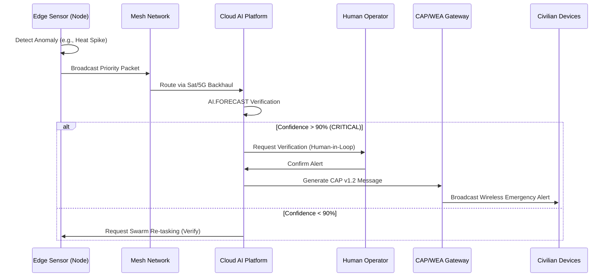
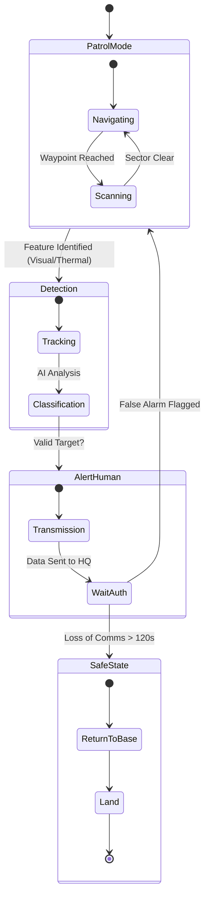
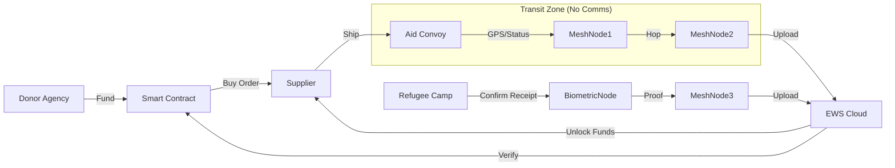
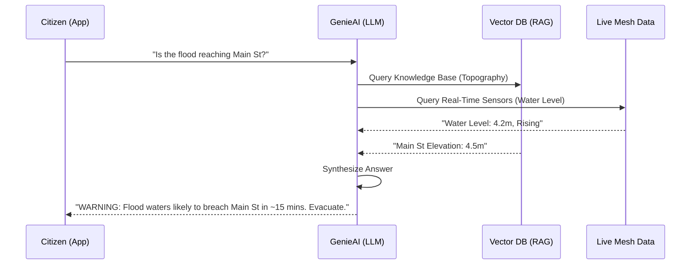
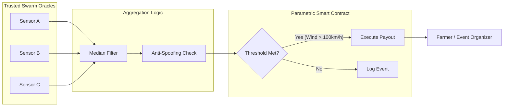

# General System Architecture: Mobile Mesh EWS

## 1. High-Level System Context

The Mobile Mesh Early Warning System (EWS) operates on a three-tier architecture: **The Edge (Swarm)**, **The Network (Nervous System)**, and **The Core (Brain)**.

```mermaid
graph TD
    subgraph Edge_Swarm ["Tier 1: The Edge (Autonomous Swarm)"]
        UAV[UAV Drones]
        UGV[UGV Rovers]
        IoT[Stationary IoT Nodes]
        Citizen[Citizen Mobile Nodes]
        Bio[Bio-Loggers]
        
        UAV <--> UGV
        UAV <--> IoT
        IoT <--> Citizen
        Citizen <--> Bio
    end

    subgraph Connectivity ["Tier 2: The Network (Hybrid Mesh)"]
        Meshnet[Ad-Hoc Mesh Protocols<br/>(AODV/TORA)]
        Backhaul_Sat[Satellite Backhaul<br/>(Starlink/Iridium)]
        Backhaul_5G[5G/6G Terrestrial]
        DTN[Disruption Tolerant<br/>Data Ferrying]
        
        Edge_Swarm <--> Meshnet
        Meshnet <--> Backhaul_Sat
        Meshnet <--> Backhaul_5G
        Meshnet -.-> DTN
    end

    subgraph Core_Cloud ["Tier 3: The Core (Central Intelligence)"]
        Ingest[Big Data Ingestion]
        RealTimeDB[(Real-Time System DB)]
        BigQuery[BigQuery AI Engine<br/>(Predictive Models)]
        Ledger[Blockchain Ledger<br/>(Audit/Smart Contracts)]
        Genie[GenieAI Chatbot<br/>(RAG Interface)]
        
        Backhaul_Sat <--> Ingest
        Backhaul_5G <--> Ingest
        DTN --> Ingest
        
        Ingest --> RealTimeDB
        RealTimeDB <--> BigQuery
        RealTimeDB --> Ledger
        RealTimeDB <--> Genie
    end

    subgraph Consumers ["Data Consumers"]
        Gov[Government Command]
        NGO[NGO / Aid Org]
        Biz[Insurance / Enterprise]
        Public[Citzen / Public]
        
        BigQuery --> Gov
        Ledger --> Biz
        Genie --> Public
        RealTimeDB --> NGO
    end
```

---

## 2. Governmental Sector Architecture

### 2.1 National Disaster Management (Data Flow)
**Problem**: Rapid alerting and situational awareness during infrastructure failure.
**Flow**: Sensors detect hazard -> AI validates -> CAP Alert broadcast.



### 2.2 Defense & Border Surveillance (Safe State)
**Problem**: Passive surveillance with strict non-lethal, human-controlled intervention.



---

## 3. NGO Sector Architecture

### 3.1 Humanitarian Aid Supply Chain
**Problem**: Verifying aid delivery in chaotic environments.
**Solution**: Blockchain-backed tracking via mesh.



### 3.2 Direct-to-Consumer Chatbot (GenieAI Integration)
**Problem**: Citizens need specific answer ("Is my street safe?"), not raw data.



---

## 4. For-Profit Sector Architecture

### 4.1 Parametric Insurance Oracle
**Problem**: Slow claims processing due to manual verification.
**Solution**: Automated payout based on trusted oracle data.



### 4.2 Commercial Urban Analytics (CAMARA API)
**Problem**: Monetizing data exhaust for retail/urban planning while preserving privacy.

```mermaid
graph TD
    RawData[Raw Mesh Data<br/>(Pings/Video/Mac Addr)]
    
    subgraph Edge_Compute ["Edge Privacy Layer"]
        Anonymizer[strip_PII()]
        Aggregate[Cluster Counting]
    end
    
    RawData --> Anonymizer
    Anonymizer --> Aggregate
    
    subgraph Telco_API ["CAMARA / Telco Cloud"]
        LocAPI[Location Retrieval API]
        QoDAPI[Quality on Demand API]
    end
    
    Aggregate --> LocAPI
    
    subgraph Biz_Value ["Commercial Services"]
        Heatmap[Retail Heatmap]
        EV_Opt[EV Charger Optimization]
        Traffic[Logistics Routing]
    end
    
    LocAPI --> Heatmap
    LocAPI --> EV_Opt
    QoDAPI --> Traffic
```
