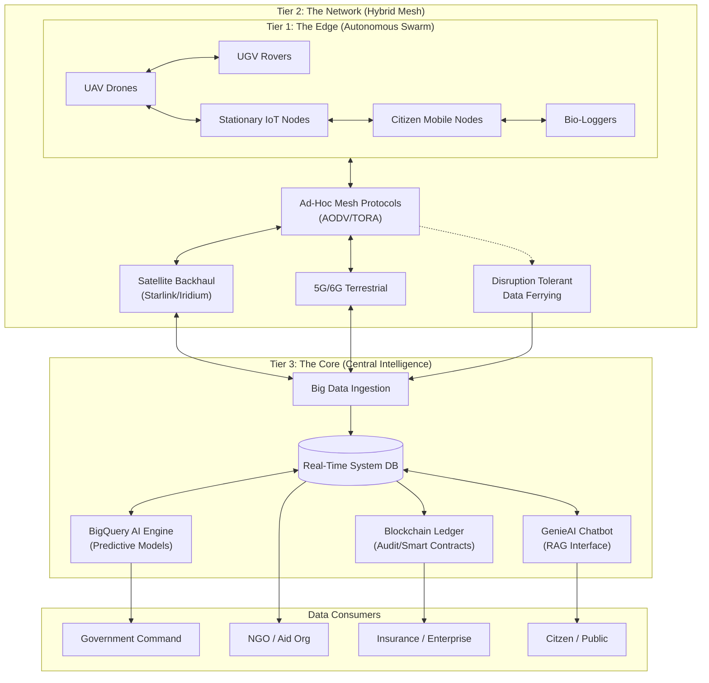
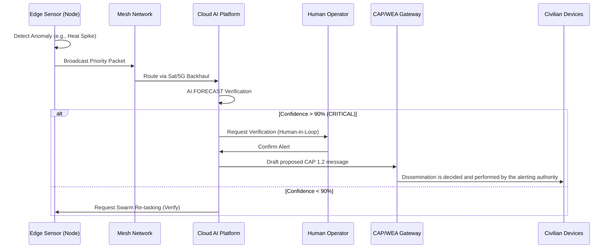
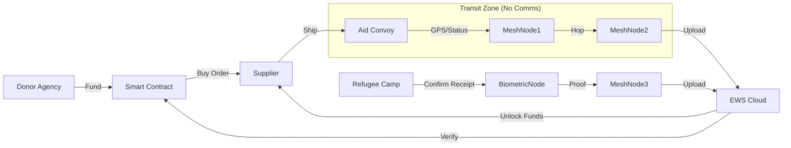
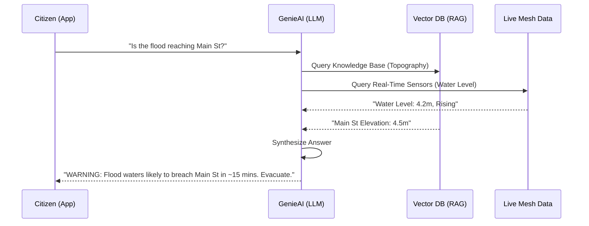
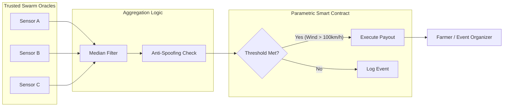
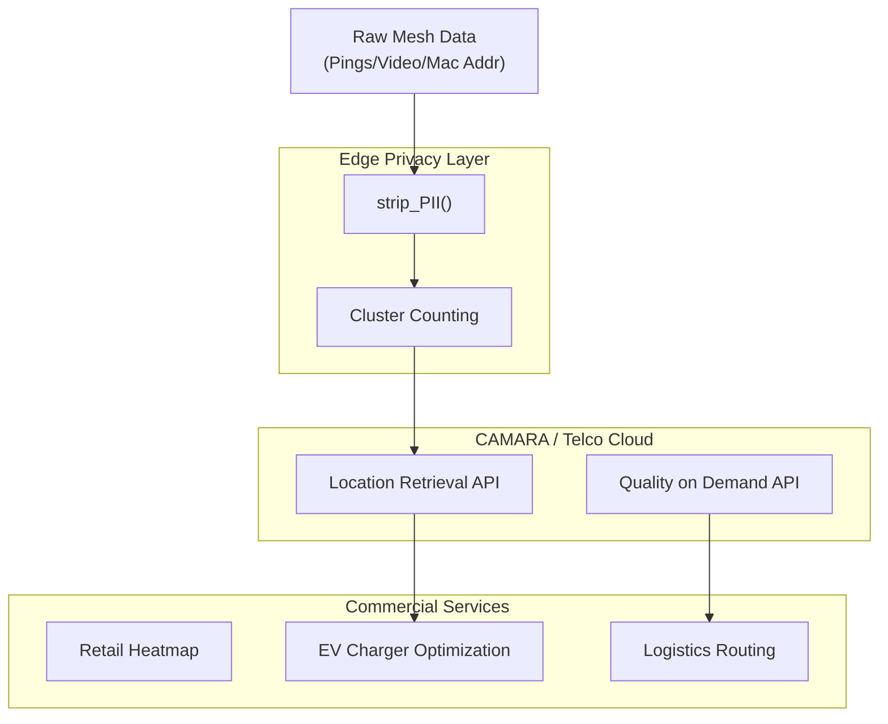

# General System Architecture: Mobile Mesh EWS

> **Status: candidate design — not verified and not implemented.**
> This document is a proposal for review. It does not describe a deployed
> capability, it authorises no public alert or physical action, and it records
> no verified result. Numeric figures are acceptance targets, not measurements.
> See [PROJECT_STATUS.md](../PROJECT_STATUS.md) for the claim policy and the document
> precedence order.

## 1. High-Level System Context

The Mobile Mesh Early Warning System (EWS) operates on a **Four-Tier Architecture**:

1. **Tier 1: The Edge (Swarm)** - Autonomous sensing and local actions.
2. **Tier 2: The Network (Nervous System)** - Resilient mesh and backhaul connectivity.
3. **Tier 3: The Core (Brain)** - Centralized AI, Big Data, and Orchestration.
4. **Tier 4: Action & Dissemination (Effectors)** - Alerts, Government Dashboards, and Public Interfaces.

### Latency Service Level Objectives (SLOs)

| Hazard Type | Detection-to-Alert Latency | Requirement |
|-------------|---------------------------|-------------|
| **Earthquake** | < 5 seconds | Automated alert is a design target requiring authority approval |
| **Flood** | < 60 seconds | Rapid validation and predictive modeling |
| **Air Quality** | < 10 minutes | Trend analysis and verified dispersal pattern |

### AI/ML Model Architectures

- **Edge AI**: TensorFlow Lite Micro running on local nodes for anomaly detection (One-Class SVM) and sensor validation.
- **Core AI**:
  - **Predictive Models**: BigQuery ML (ARIMA_PLUS, XGBoost) for time-series forecasting.
  - **Generative AI**: GenieAI (Gemini Pro/Flash) for RAG-based query answering.
  - **Vision AI**: CNNs (ResNet-50 optimized) on Border Drones for object classification.

### Hybrid Coordination Strategy

- **Decentralized**: Local swarms use consensus (Raft-over-Mesh) for immediate collision avoidance and local data aggregation.
- **Centralized**: The Core Cloud provides strategic directives (e.g., "Scan Sector 7") and long-term model retraining.

```mermaid
graph TD
    subgraph Edge_Swarm ["Tier 1: The Edge (Autonomous Swarm)"]
        UAV[UAV Drones]
        UGV[UGV Rovers]
        IoT[Stationary IoT Nodes]
        Citizen[Citizen Mobile Nodes]
        Bio[Bio-Loggers]
        
        UAV <--> UGV
        UAV <--> IoT
        IoT <--> Citizen
        Citizen <--> Bio
    end

    subgraph Connectivity ["Tier 2: The Network (Hybrid Mesh)"]
        Meshnet["Ad-Hoc Mesh Protocols<br/>(AODV/TORA)"]
        Backhaul_Sat["Satellite Backhaul<br/>(Starlink/Iridium)"]
        Backhaul_5G[5G/6G Terrestrial]
        DTN["Disruption Tolerant<br/>Data Ferrying"]
        
        Edge_Swarm <--> Meshnet
        Meshnet <--> Backhaul_Sat
        Meshnet <--> Backhaul_5G
        Meshnet -.-> DTN
    end

    subgraph Core_Cloud ["Tier 3: The Core (Central Intelligence)"]
        Ingest[Big Data Ingestion]
        RealTimeDB[(Real-Time System DB)]
        BigQuery["BigQuery AI Engine<br/>(Predictive Models)"]
        Ledger["Blockchain Ledger<br/>(Audit/Smart Contracts)"]
        Genie["GenieAI Chatbot<br/>(RAG Interface)"]
        
        Backhaul_Sat <--> Ingest
        Backhaul_5G <--> Ingest
        DTN --> Ingest
        
        Ingest --> RealTimeDB
        RealTimeDB <--> BigQuery
        RealTimeDB --> Ledger
        RealTimeDB <--> Genie
    end

    subgraph Consumers ["Data Consumers"]
        Gov[Government Command]
        NGO[NGO / Aid Org]
        Biz[Insurance / Enterprise]
        Public[Citzen / Public]
        
        BigQuery --> Gov
        Ledger --> Biz
        Genie --> Public
        RealTimeDB --> NGO
    end
```

---

## 2. Governmental Sector Architecture

### 2.1 National Disaster Management (Data Flow)

**Problem**: Rapid alerting and situational awareness during infrastructure failure.
**Flow**: Sensors detect hazard -> analysis produces an evidence package -> a human operator reviews it -> the responsible authority decides on dissemination.

```mermaid
sequenceDiagram
    participant Sensor as Edge Sensor (Node)
    participant Mesh as Mesh Network
    participant Cloud as Cloud AI Platform
    participant Human as Human Operator
    participant CAP as CAP/WEA Gateway
    participant Public as Civilian Devices

    Sensor->>Sensor: Detect Anomaly (e.g., Heat Spike)
    Sensor->>Mesh: Broadcast Priority Packet
    Mesh->>Cloud: Route via Sat/5G Backhaul
    Cloud->>Cloud: AI.FORECAST Verification
    
    alt Confidence > 90% (CRITICAL)
        Cloud->>Human: Request Verification (Human-in-Loop)
        Human->>Cloud: Confirm Alert
        Cloud->>CAP: Draft proposed CAP 1.2 message
        CAP->>Public: Dissemination is decided and performed by the alerting authority
    else Confidence < 90%
        Cloud->>Sensor: Request Swarm Re-tasking (Verify)
    end
```

### 2.2 Defence and surveillance: excluded

Targeting, weapons coordination, individual tracking, covert surveillance, border security, and defence operations are **excluded** from this design and from contributions. They are named as exclusions in
[Assumptions and Boundaries](ASSUMPTIONS_AND_BOUNDARIES.md) and
[Compliance and Ethics](../Compliance_and_Ethics.md). An earlier revision of this
document sketched a surveillance state machine here; it has been removed rather
than softened.

## 3. NGO Sector Architecture

### 3.1 Humanitarian Aid Supply Chain

**Problem**: Verifying aid delivery in chaotic environments.
**Solution**: Blockchain-backed tracking via mesh.

```mermaid
flowchart LR
    Donor[Donor Agency] -->|Fund| Contract[Smart Contract]
    Contract -->|Buy Order| Supplier
    Supplier -->|Ship| Truck[Aid Convoy]
    
    subgraph Transit ["Transit Zone (No Comms)"]
        Truck -->|GPS/Status| MeshNode1
        MeshNode1 -->|Hop| MeshNode2
    end
    
    MeshNode2 -->|Upload| Cloud[EWS Cloud]
    Cloud -->|Verify| Contract
    
    Recipient[Refugee Camp] -->|Confirm Receipt| BiometricNode
    BiometricNode -->|Proof| MeshNode3
    MeshNode3 -->|Upload| Cloud
    
    Cloud -->|Unlock Funds| Supplier
```

### 3.2 Direct-to-Consumer Chatbot (GenieAI Integration)

**Problem**: Citizens need specific answer ("Is my street safe?"), not raw data.

```mermaid
sequenceDiagram
    participant User as Citizen (App)
    participant Genie as GenieAI (LLM)
    participant Vector as Vector DB (RAG)
    participant Live as Live Mesh Data
    
    User->>Genie: "Is the flood reaching Main St?"
    Genie->>Vector: Query Knowledge Base (Topography)
    Genie->>Live: Query Real-Time Sensors (Water Level)
    Live-->>Genie: "Water Level: 4.2m, Rising"
    Vector-->>Genie: "Main St Elevation: 4.5m"
    
    Genie->>Genie: Synthesize Answer
    Genie-->>User: "WARNING: Flood waters likely to breach Main St in ~15 mins. Evacuate."
```

---

## 4. For-Profit Sector Architecture

### 4.1 Parametric Insurance Oracle

**Problem**: Slow claims processing due to manual verification.
**Solution**: Automated payout based on trusted oracle data.

```mermaid
graph LR
    subgraph Oracles ["Trusted Swarm Oracles"]
        S1[Sensor A]
        S2[Sensor B]
        S3[Sensor C]
    end
    
    subgraph Logic ["Aggregation Logic"]
        Agg[Median Filter]
        Verify[Anti-Spoofing Check]
    end
    
    subgraph Contract ["Parametric Smart Contract"]
        Trigger{Threshold Met?}
        Payout[Execute Payout]
        Deny[Log Event]
    end
    
    S1 --> Agg
    S2 --> Agg
    S3 --> Agg
    
    Agg --> Verify
    Verify --> Trigger
    
    Trigger -- Yes (Wind > 100km/h) --> Payout
    Trigger -- No --> Deny
    
    Payout --> Insured[Farmer / Event Organizer]
```

### 4.2 Commercial Urban Analytics (CAMARA API)

**Problem**: Monetizing data exhaust for retail/urban planning while preserving privacy.

```mermaid
graph TD
    RawData["Raw Mesh Data<br/>(Pings/Video/Mac Addr)"]
    
    subgraph Edge_Compute ["Edge Privacy Layer"]
        Anonymizer["strip_PII()"]
        Aggregate["Cluster Counting"]
    end
    
    RawData --> Anonymizer
    Anonymizer --> Aggregate
    
    subgraph Telco_API ["CAMARA / Telco Cloud"]
        LocAPI["Location Retrieval API"]
        QoDAPI["Quality on Demand API"]
    end
    
    Aggregate --> LocAPI
    
    subgraph Biz_Value ["Commercial Services"]
        Heatmap["Retail Heatmap"]
        EV_Opt["EV Charger Optimization"]
        Traffic["Logistics Routing"]
    end
    
    LocAPI --> EV_Opt
    QoDAPI --> Traffic
```

## 5. Architectural Weaknesses and Gaps

- **Data Flow Specifics**: The high-level architecture requires more detailed data pipeline diagrams specifying message formats (Protobuf/Avro) and error handling queues (Dead Letter Queues).
- **Security Boundaries**: Explicit trust zones and authentication flows between the Mesh and Cloud need stricter definition (Zero Trust implementation).
- **Failover Mechanisms**: While Swarm is resilient, the Cloud Core needs explicit Multi-Region Disaster Recovery (DR) and High Availability (HA) strategies documented.
- **Requirements Traceability**: Mapping system requirements to specific architectural components is currently high-level and needs a detailed RTM.
