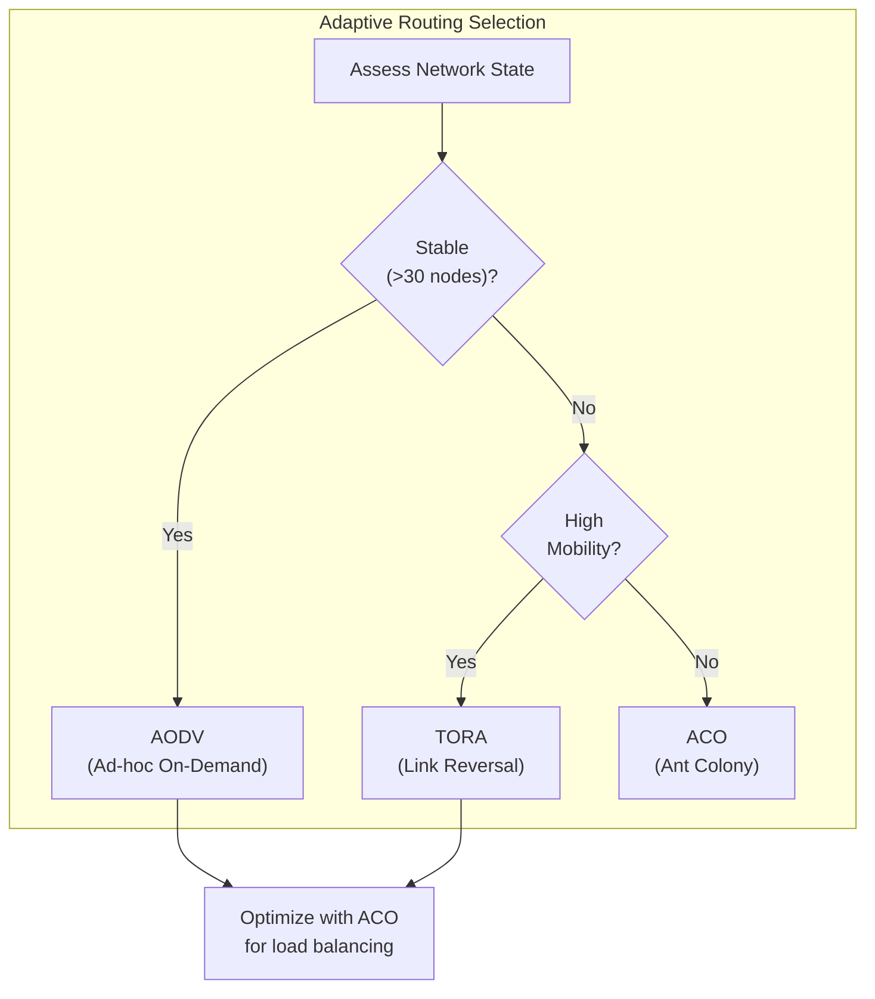
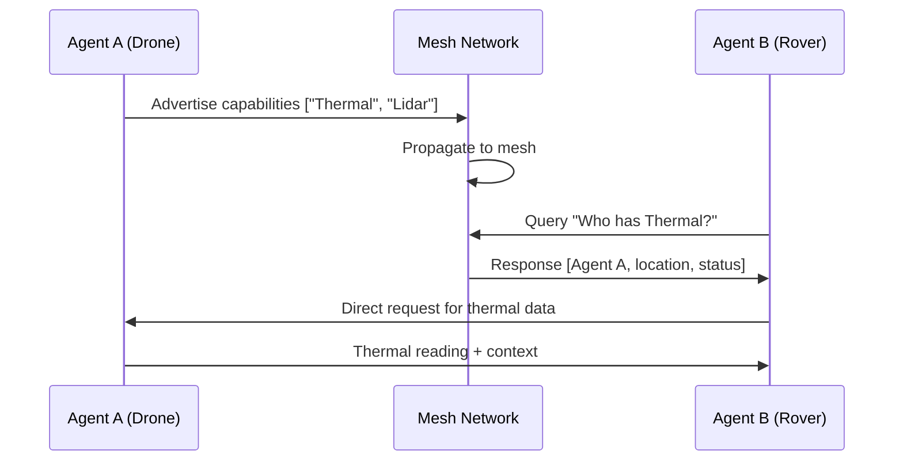
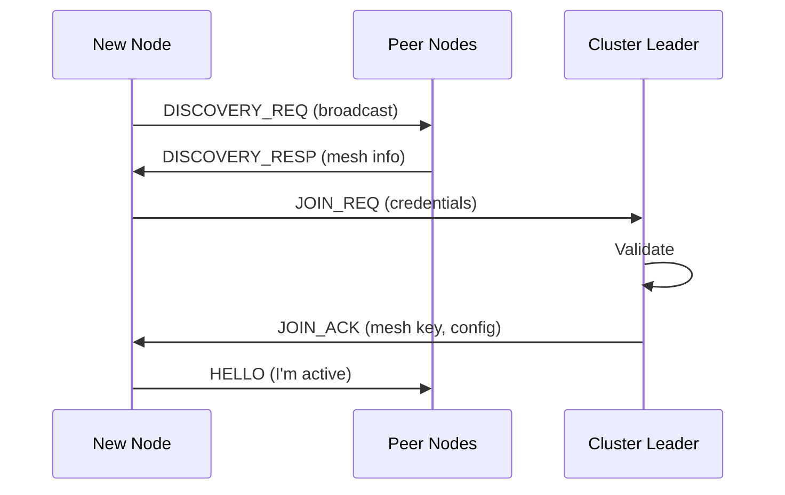

# Technical Protocols - SwarmSystem

## Technical Protocols Overview

This document details the specific technical protocols used throughout the SwarmSystem architecture, covering mesh networking, communication, and agent coordination.

## Mesh Networking Protocols

### Routing Protocol Selection

The system uses a hybrid routing approach based on operational context:



### AODV (Ad-hoc On-Demand Distance Vector)

**Use Case:** General monitoring phase with stable topology (>30 nodes)

**Characteristics:**
- Reactive protocol - routes discovered on-demand
- Lower overhead in static networks
- Best for backbone mesh during steady-state monitoring

**PRD Reference:** REQ-COM-004

```
Route Discovery:
Node A → RREQ broadcast → Intermediate nodes → Node D
Node D → RREP unicast → Back to Node A
```

### TORA (Temporally Ordered Routing Algorithm)

**Use Case:** Active response phase with fast-moving UAV swarms

**Characteristics:**
- Link-reversal algorithm
- High redundancy, rapid adaptation
- Maintains multiple routes simultaneously
- Best during rapid deployment/maneuvers

**PRD Reference:** REQ-COM-005

### ACO (Ant Colony Optimization)

**Use Case:** Resource optimization across entire mesh

**Characteristics:**
- Bio-inspired probabilistic routing
- "Digital pheromones" track link quality + battery
- Naturally load-balances across network
- Runs as overlay optimization layer

**PRD Reference:** REQ-COM-006


## Physical Layer Protocols

### OTFS (Orthogonal Time Frequency Space)

**Use Case:** High-velocity drone swarms in 6G networks

**Problem Solved:** Traditional OFDM degrades under Doppler shift from fast-moving nodes

**PRD Reference:** REQ-COM-008

```
OTFS vs OFDM Performance:
+----------------+--------+--------+
| Velocity       | OFDM   | OTFS   |
+----------------+--------+--------+
| 0 km/h         | 98%    | 98%    |
| 120 km/h       | 85%    | 97%    |
| 300 km/h       | 60%    | 95%    |
+----------------+--------+--------+
% = Packet Delivery Ratio
```

### ISAC (Integrated Sensing and Communication)

**Use Case:** 6G nodes using radio waves for both data AND sensing

**Capabilities:**
- Obstacle detection via RF radar
- Terrain mapping in low-visibility (smoke/fog)
- Works when optical sensors fail

**PRD Reference:** REQ-EDGE-005

## Agent Coordination Protocols

### A2A (Agent-to-Agent Protocol)
**Use Case:** Inter-agent capability discovery and coordination

**Mechanism:**


**Capability Schema:**
```json
{
  "agent_id": "drone-alpha-7",
  "capabilities": ["thermal_sensor", "lidar", "visual"],
  "location": {"s2_cell": "...", "altitude_m": 150},
  "status": "active",
  "battery_pct": 72,
  "version": "a2a-v2.1"
}
```
**PRD Reference:** PRD Other #5.2

### MCP (Model Context Protocol)
**Use Case:** Context-aware data exchange between agents and AI systems

**Mechanism:**
- Every data point includes rich metadata
- Context preserved from edge to cloud
- Enables semantic understanding by AI

**Context Schema:**
```json
{
  "value": 45.2,
  "unit": "celsius",
  "source_id": "sensor-xyz",
  "location": {"lat": 35.6, "lon": 139.7},
  "timestamp": "2024-01-15T10:30:00Z",
  "confidence": 0.95,
  "measurement_conditions": {
    "altitude_m": 10,
    "wind_speed_kmh": 15,
    "sensor_calibration_date": "2024-01-01"
  }
}
```
**PRD Reference:** PRD Other #5.2

### Version Compatibility
**Requirement:** Forward and backward compatibility in multi-version mesh
**Mechanism:**
- Versioned message headers
- Core payload always parseable
- New metadata fields ignored by old nodes
- Graceful degradation, no partition

**PRD Reference:** PRD Other #5.2

```
V1 Node receives V2 Message:
├── Parse header (version=2)
├── Extract core payload (always compatible)
├── Ignore unknown fields
└── Process successfully (degraded)
```

## Operational Support Protocols (Integrated Extensions)

### Messaging & Notification Protocols
**Use Case:** Delivering low-latency alerts via civilian apps (Communications_APIs)
**Integration:** Notification Service

| Channel | Protocol | Format | Use Case |
|---------|----------|--------|----------|
| **WhatsApp/Telegram** | HTTPS (Webhook) | JSON | Rich media alerts, chatbot interaction |
| **SMS** | SMPP / REST | Plain Text | Fallback for non-smartphone users |
| **RCS** | UP 2.0 | Rich Card | Interactive alerts on Android |

**Flow:**
```
Event Bus → Notification Service → Twilio/WhatsApp API → User Device
```

### IoT Management Protocols
**Use Case:** Managing SIM lifecycles and device configurations (IoT_Operations)
**Integration:** IoT Manager

| Protocol | Usage | PRD Context |
|----------|-------|-------------|
| **LwM2M / CoAP** | Lightweight device management | Over-the-air firmware updates for resource-constrained nodes |
| **eSIM / RSP** | GSMA SGP.22 | Remote SIM provisioning for global roaming |
| **MQTT-SN** | Telemetry | Low-bandwidth update of device health status |

### Blockchain/Ledger Protocols
**Use Case:** Immutable audit logging for critical decisions (Distributed_Ledgers_Operations)
**Integration:** Ledger Service

| Platform | Protocol | Role |
|----------|----------|------|
| **Hyperledger Fabric** | gRPC (Fabric SDK) | Private permissioned logging of AI decisions |
| **Ethereum** | JSON-RPC (Web3) | Public anchor for transparency/verification |

**Audit Log Schema Example:**
```json
{
  "decision_id": "uuid",
  "trigger_event": "hash(sensor_data)",
  "ai_model_version": "v3.4",
  "alert_issued": true,
  "timestamp": 1704040000,
  "signature": "node_private_key_sig"
}
```

## Transport Protocols

### Data Transport Stack

| Layer | Protocol | Use Case |
|-------|----------|----------|
| **Application** | gRPC, REST, WebSocket | Cloud services, C2 interface |
| **Presentation** | Protobuf, JSON | Mesh: Protobuf (compact), Cloud: JSON (debug) |
| **Session** | mTLS, DTLS | Secure channels |
| **Transport** | TCP, UDP | TCP for cloud, UDP for mesh |
| **Network** | IPv6, 6LoWPAN | IoT addressing |
| **Data Link** | 802.15.4, BLE Mesh, WiFi | Mesh networking |
| **Physical** | 5G NR, OTFS, LoRa | Wireless |

### Binary Serialization
**Requirement:** Minimize bandwidth in constrained environments
**PRD Reference:** Constraint in #13.1

| Format | Size | Parse Speed | Use Case |
|--------|------|-------------|----------|
| **Protobuf** | Smallest | Fast | Mesh traffic |
| **MessagePack** | Small | Fast | Alternative |
| **JSON** | Large | Slow | Debugging/APIs |

## Alert Protocols

### CAP v1.2 (Common Alerting Protocol)
**Standard:** ITU-T X.1303, OASIS CAP v1.2

**Structure:**
```xml
<alert xmlns="urn:oasis:names:tc:emergency:cap:1.2">
  <identifier>uuid</identifier>
  <sender>swarm-system-authority</sender>
  <sent>2024-01-15T10:30:00-08:00</sent>
  <status>Actual</status>
  <msgType>Alert</msgType>
  <scope>Public</scope>
  
  <info>
    <language>en-US</language>
    <category>Met</category>
    <event>Wildfire</event>
    <urgency>Immediate</urgency>
    <severity>Extreme</severity>
    <certainty>Observed</certainty>
    <headline>Wildfire detected...</headline>
    <description>...</description>
    <instruction>Evacuate immediately</instruction>
    <area>
      <polygon>35.1,-120.5 35.2,-120.4...</polygon>
    </area>
  </info>
  <!-- Additional <info> blocks for other languages -->
</alert>
```
**PRD Reference:** REQ-EXT-005, PRD Other #4.1

### WEA (Wireless Emergency Alerts)
**Standard:** ATIS 07 000 10
**Integration:**
- CAP Gateway → IPAWS → Cell Carriers → WEA Broadcast
- Polygon-based geo-targeting
- 90/360 character limits per message class
**PRD Reference:** REQ-EXT-006, REQ-EXT-007

## Discovery Protocols

### Mesh Auto-Discovery
**Mechanism:**
1. New node broadcasts join request
2. Nearby nodes respond with mesh info
3. Cluster leader validates credentials
4. Node receives mesh keys and config
5. Starts participating in routing
**PRD Reference:** REQ-GEN-006



## Protocol Summary Matrix

| Protocol | Layer | Purpose | PRD Ref |
|----------|-------|---------|---------|
| **AODV** | Network | Stable mesh routing | REQ-COM-004 |
| **TORA** | Network | Dynamic mesh routing | REQ-COM-005 |
| **ACO** | Network | Load optimization | REQ-COM-006 |
| **OTFS** | Physical | High-velocity 6G | REQ-COM-008 |
| **ISAC** | Physical | RF sensing | REQ-EDGE-005 |
| **A2A** | Application | Agent coordination | PRD Other #5.2 |
| **MCP** | Application | Context preservation | PRD Other #5.2 |
| **CAP v1.2** | Application | Alert format | REQ-EXT-005 |
| **LwM2M** | Mgmt | IoT Device Management | IoT_Operations |
| **SMPP/HTTPS** | App | Consumer Messaging | Communications_APIs |
| **Fabric SDK** | App | Blockchain Audit | Distributed_Ledgers |

---

*This document details the technical protocols used in the SwarmSystem.*
