# User Flows and Scenarios - SwarmSystem

## User Flows Overview

This document describes the high-level user interactions, system state diagrams, and detailed scenarios for various disaster types supported by the SwarmSystem.

## Actor Flows

### Emergency Operator Flow

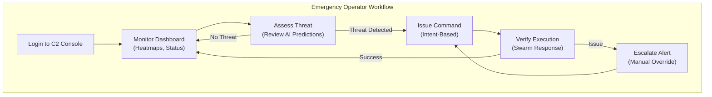

**Key Interactions:**
- Intent-based commands: "Search Area A", "Monitor Perimeter B"
- Swarm visualizations: Heatmaps, flow vectors (not individual dots)
- Confidence metrics displayed for all AI predictions

**PRD Reference:** REQ-HSI-001, REQ-HSI-002

### Field Personnel Flow

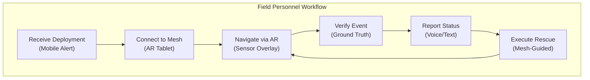

**Key Features:**
- AR overlay shows sensor data (radiation, heat, gas)
- Mesh connection for local comms even without cell
- Real-time guidance to survivors

**PRD Reference:** REQ-HSI-003

### Civilian User Flow

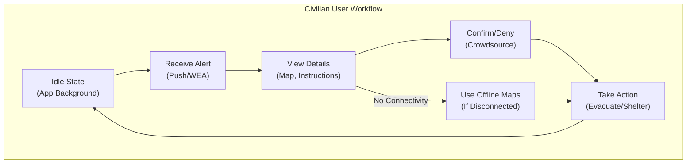

**Key Features:**
- Override Do Not Disturb for Immediate alerts
- Multi-language support (auto-detect from device)
- Offline cached maps and evacuation routes

**PRD Reference:** PRD Other #6.1, #6.2

## System State Diagrams

### Node Lifecycle States

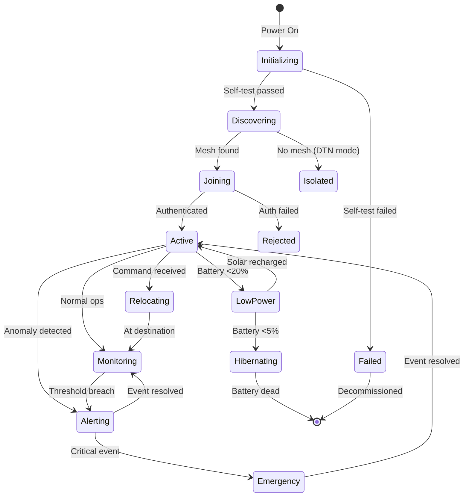

### Alert State Machine

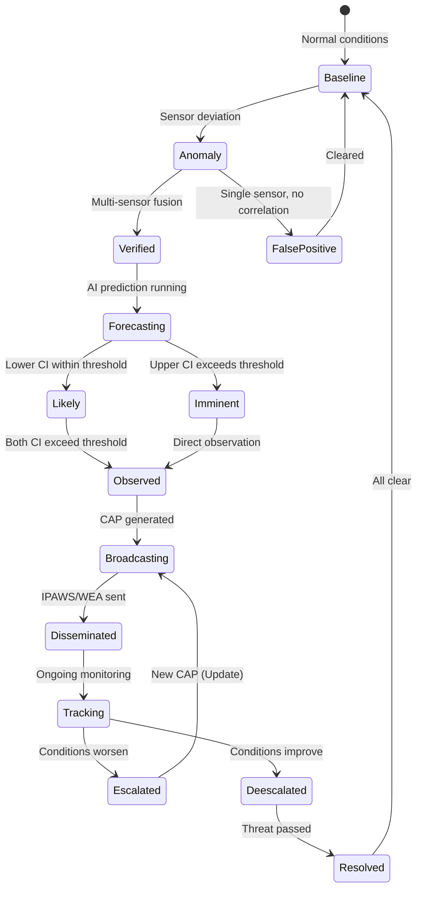

### Swarm Formation States

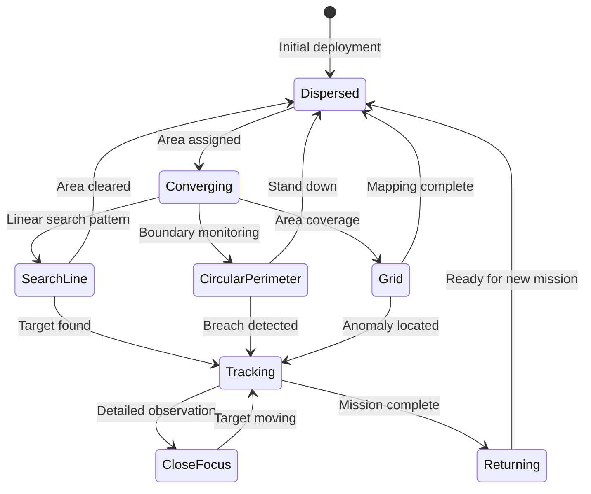

## Disaster Scenarios

### Scenario 1: Wildfire Early Detection

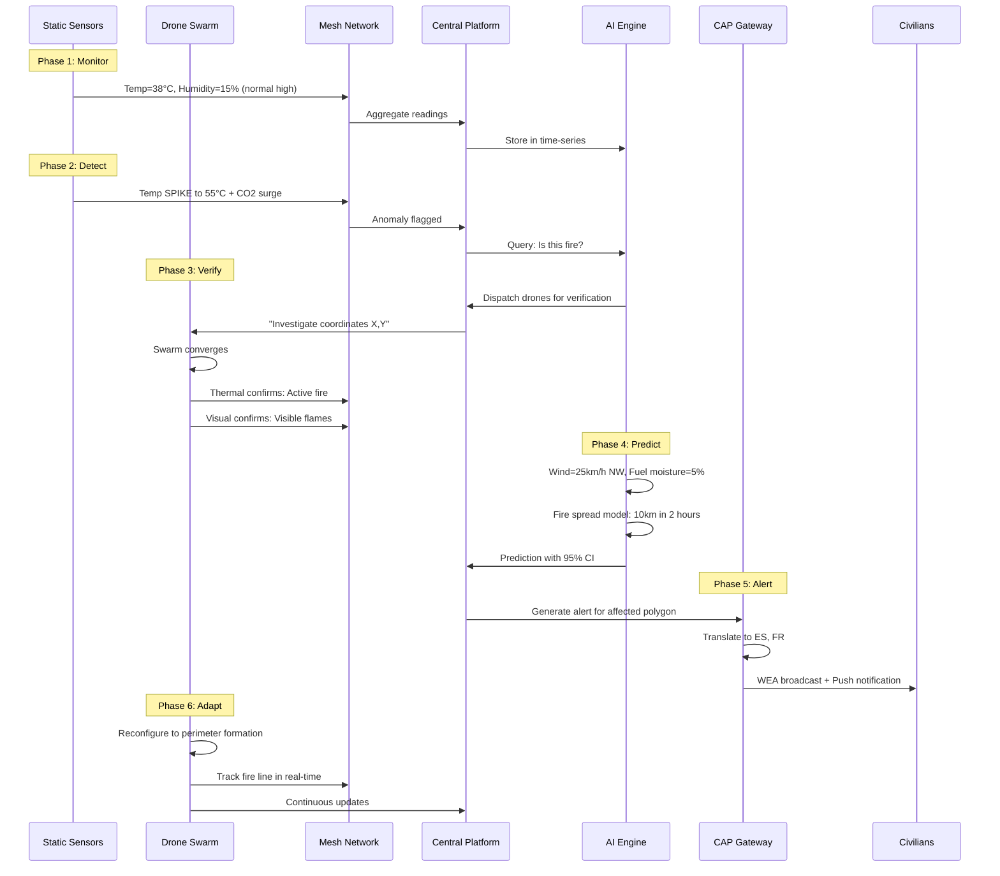

**Requirements Covered:** REQ-EDGE-004, REQ-EDGE-006, REQ-AI-001, REQ-EXT-005, REQ-EXT-006

---

### Scenario 2: Flood Early Warning

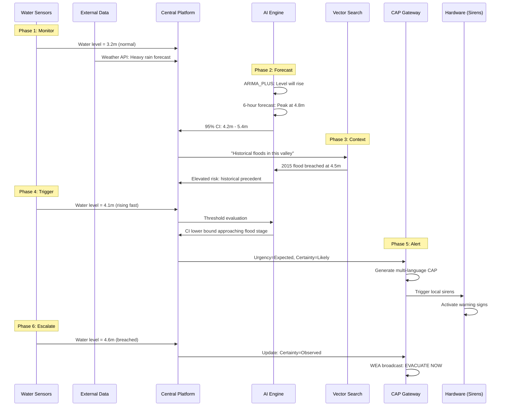

**Requirements Covered:** REQ-PLAT-007, REQ-AI-003, PRD Other #3.2, PRD Other #4.3

---

### Scenario 3: Earthquake Response

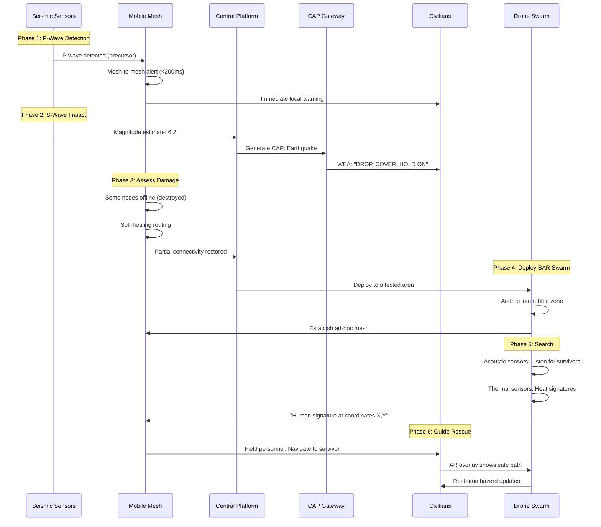

**Requirements Covered:** REQ-COM-002, REQ-EDGE-004, Use Case 10.2

---

### Scenario 4: Tsunami Warning

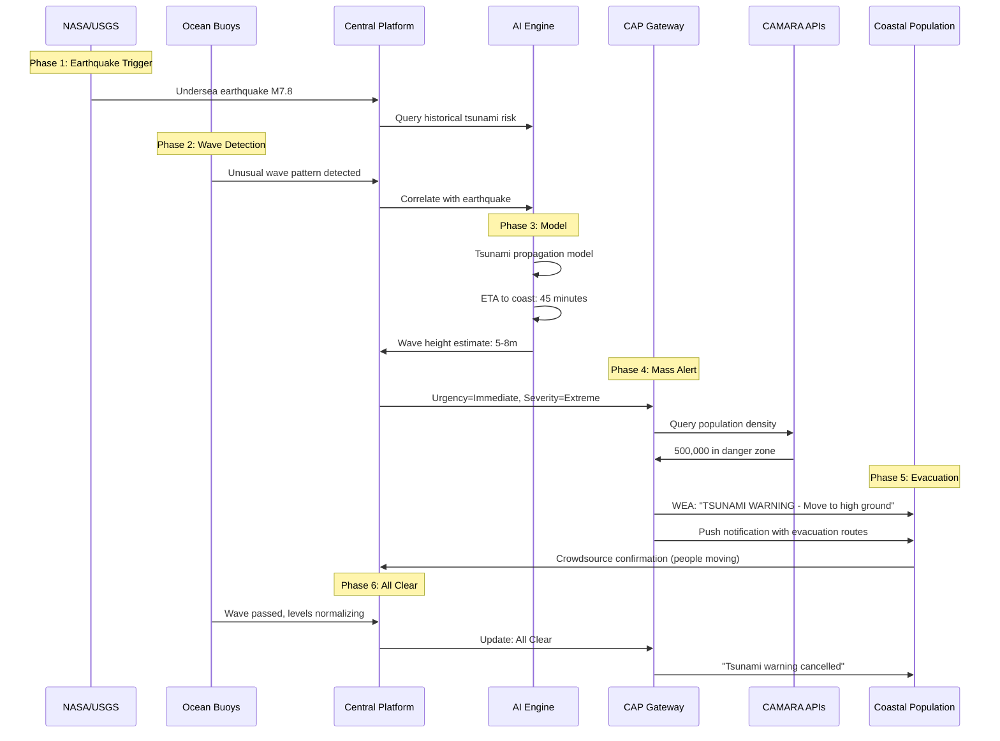

**Requirements Covered:** REQ-EXT-001, REQ-EXT-004, User Req #5 (CAMARA)

---

### Scenario 5: Tornado Warning

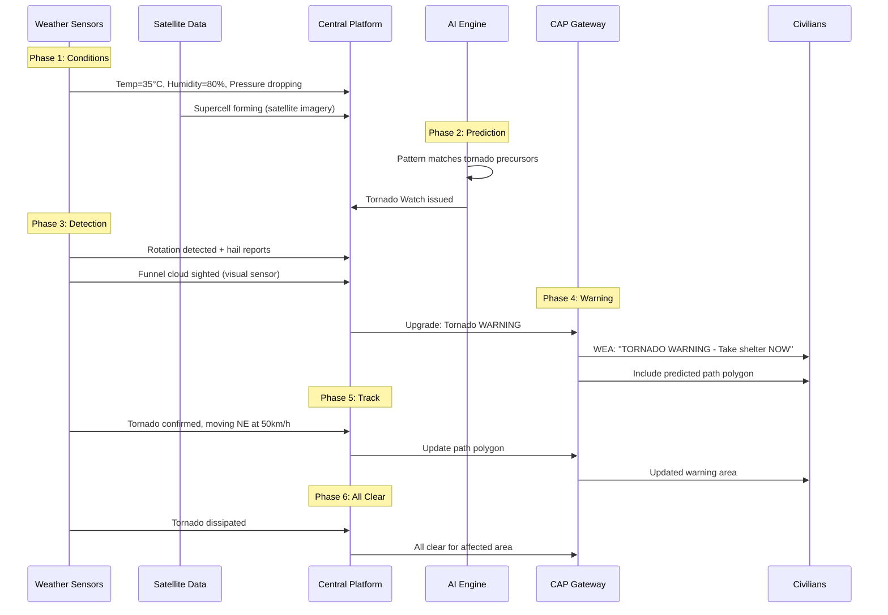

---

### Scenario 6: Urban Mob / Civil Emergency

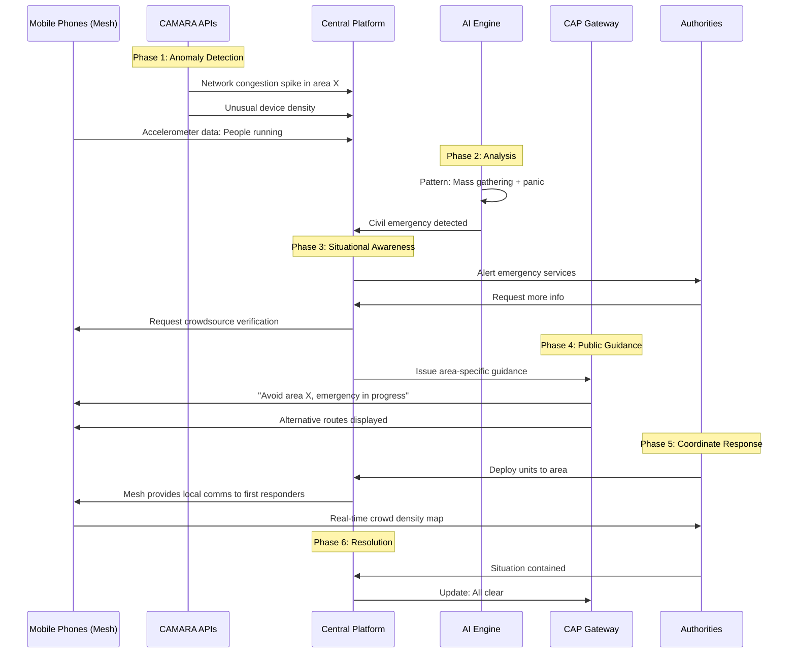

**Requirements Covered:** User Req #5 (CAMARA), PRD Other #3.4

---

### Scenario 7: Search and Rescue (SAR)

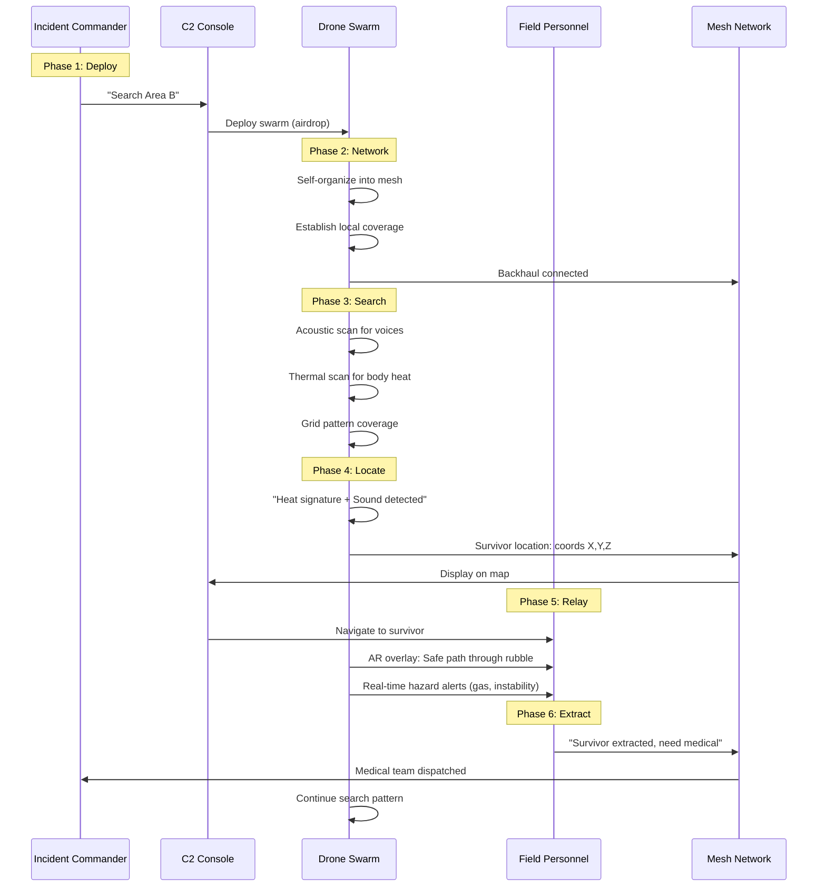

**Requirements Covered:** Use Case 10.2, REQ-HSI-003

## Chatbot Interaction Flow (Framework AI)

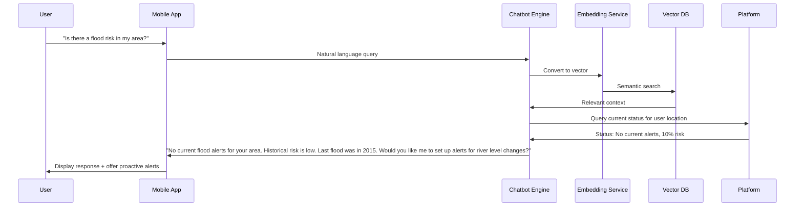

**Requirements Covered:** User Req #6 (Framework AI chatbot)

## Requirements Summary

| Scenario | PRD Requirements Covered |
|----------|-------------------------|
| Wildfire | REQ-EDGE-004, REQ-EDGE-006, REQ-AI-001, REQ-EXT-005, REQ-EXT-006 |
| Flood | REQ-PLAT-007, REQ-AI-003, PRD Other #3.2, #4.3 |
| Earthquake | REQ-COM-002, REQ-EDGE-004, Use Case 10.2 |
| Tsunami | REQ-EXT-001, REQ-EXT-004, CAMARA (User #5) |
| Tornado | REQ-AI-001, REQ-EXT-005 |
| Urban Mob | CAMARA (User #5), PRD Other #3.4 |
| SAR | Use Case 10.2, REQ-HSI-003 |
| Chatbot | Framework AI (User #6) |

---

*This document describes user flows, system states, and disaster scenarios for the SwarmSystem.*
