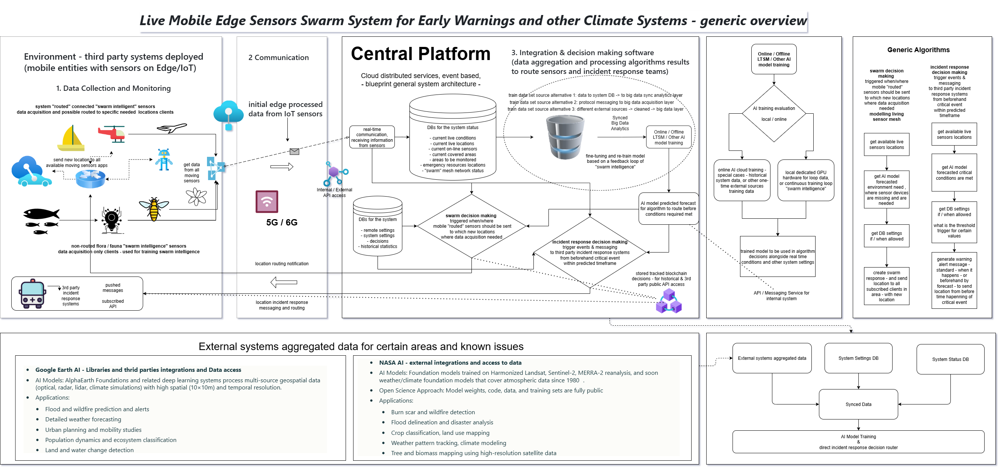

# Climate Early Warning System 
## Mobile Mesh SwarmSystem

## 🌍 Overview

- **Live Mobile Swarm Mesh for Early Warnings and Climate Monitoring**
- **System Requirements and Specs, Architecture Proposals & Parts Implementations**

> [ Innovative Swarm System Architecture with Live Mobile Edge Sensors for Climate Monitoring](https://medium.com/@andrei-besleaga/innovative-swarm-system-architecture-with-live-mobile-edge-sensors-for-climate-monitoring-and-eb0124e7b451)

This project implements a decentralized, autonomous **Swarm Intelligence** network using mobile edge sensors (EVs, Drone Swarms, IoT) to provide hyper-local climate monitoring and real-time disaster response. It integrates with global satellite data to form a comprehensive layout for Next-Gen Early Warning Systems (EWS).

Part of the concept proposed in [this article on multi-hazard EWS](https://medium.com/@andrei-besleaga/innovative-usage-of-emerging-it-technologies-in-multi-hazard-early-warning-systems-7bcfe3d170b9).

---

## 📚 Core Documentation

The system is specified and architected in the following documents:

| Component | Document | Description |
|-----------|----------|-------------|
| **Product Specs** | [**PRD_Swarm_System_Requirements.md**](./PRD_Swarm_System_Requirements_Specification.md) | Functional & non-functional requirements |
| **Integrations** | [**PRD_Other_Integrations.md**](./PRD_Other_Integrations.md) | Specs for AI, CAP, VisualGrid, and external APIs |
| **Architecture** | [**ARCHITECTURE_INDEX.md**](./ARCHITECTURE/ARCHITECTURE_INDEX.md) | **MAIN ENTRY POINT**: C4 diagrams, flows, security, protocols |

---

## 🏗️ System Architecture

The architecture follows the **C4 Model** and is detailed in the `ARCHITECTURE/` directory.

### Key Architecture Views
*   **[Context & Scope](./ARCHITECTURE/C4_Context.md)**: System boundaries and external actors involved.
*   **[Containers & Tech Stack](./ARCHITECTURE/C4_Container.md)**: Cloud services, AI engines, Mesh networks.
*   **[Data Flow](./ARCHITECTURE/DataFlow.md)**: End-to-end data pipelines from sensor to alert.
*   **[Disaster Scenarios](./ARCHITECTURE/UserFlows.md)**: User flows for Wildfire, Flood, Earthquake, etc.
*   **[Technical Protocols](./ARCHITECTURE/TechnicalProtocols.md)**: AODV/TORA Mesh, LwM2M, OTFS, and A2A.

For a full list of diagrams and docs, see the [Architecture Index](./ARCHITECTURE/ARCHITECTURE_INDEX.md).

---

## 🧩 Subsystems and Modules

The repository is organized into generalized modules and subsystem implementations:

- **[BigData_AI_Decision_System](./BigData_AI_Decision_System/)**: End-to-end AI decision engine on Google BigQuery (Gemini, Vector Search, Earth Engine).
- **[Framework_AI_Integration](./Framework_AI_Integration/)**: AI Agent framework integration (GENIEAI/OPEA/Haystack).
- **[CAMARA_Telecom_Operations](./CAMARA_Telecom_Operations/)**: Mobile Network APIs for urban density/geofencing.
- **[IoT_Operations](./IoT_Operations/)**: SIM lifecycle and remote device management.
- **[Communications_APIs](./Communications_APIs/)**: Multi-channel messaging (WhatsApp, Telegram, SMS).
- **[Distributed_Ledgers_Operations](./Distributed_Ledgers_Operations/)**: Blockchain integration for immutable audit logs.
- **[Remote_Operations](./Remote_Operations/)**: Specific device/robot integrations.

---

## 🚀 Key Features

### 1. Mobile Sensor Mesh
A distributed network of mobile devices acting as live sensors:
*   **EVs & Ground Vehicles**: Air quality, road conditions, hyper-local weather.
*   **Drones & UAVs**: Aerial thermal imaging, atmospheric sampling, disaster assessment.
*   **Maritime**: Ocean health, wave data, salinity.

### 2. Swarm Intelligence
Nodes operate autonomously using mesh protocols and Swarm Intelligence to optimize routing and coverage without centralized control during critical failures.

### 3. AI & Prediction
*   **Real-time Analysis**: Edge AI for immediate anomaly detection.
*   **Forecasting**: Cloud-based BigQuery AI / Vertex AI for predictive modeling.
*   **Integration**: Fuses ground truth with NASA/Google Earth Engine satellite data.

### 4. Disaster Response
*   **CAP v1.2 Compliance**: Standardized alerts for global interoperability.
*   **Multi-Channel**: Delivers warnings via WEA, Mobile Apps, and IoT signage.
*   **Crowdsourced Verification**: Human-in-the-loop validation of alerts.

---

## 🔗 References
*   [Article: Swarm System Architecture](https://medium.com/@andrei-besleaga/innovative-swarm-system-architecture-with-live-mobile-edge-sensors-for-climate-monitoring-and-eb0124e7b451)
*   [Article: Emerging Tech in EWS](https://medium.com/@andrei-besleaga/innovative-usage-of-emerging-it-technologies-in-multi-hazard-early-warning-systems-7bcfe3d170b9)
*   [Project BigData AI Decision System](https://github.com/andreibesleaga/mobile-mesh-ews/tree/main/BigData_AI_Decision_System)

---
*Last Updated: January 2026*
